# Lab 04: Azure Arc-enable on-premises VM

### Estimated Duration: 20 Minutes

In this lab, you will onboard an on-premises Windows virtual machine to Azure using Azure Arc. This will allow the VM to be managed like an Azure resource directly from the Azure portal, even though it is hosted outside Azure.

## Lab Objectives

- Understand the concept of Azure Arc-enabled servers.

- Connect an on-premises Windows VM to Azure using the Azure Connected Machine agent.

- Register and manage a non-Azure machine from the Azure portal.

- Verify successful onboarding of the server into Azure Arc.

### Task 1: Run workloads anywhere with Azure Cloud Services

In this exercise, you will deploy and configure the Azure Connected Machine agent on a Windows machine hosted outside of Azure, to ensure that it can be managed through Azure Arc-enabled servers.

1. In the search bar of the Azure portal, type **Azure arc (1)** and select **Azure Arc (2)** from suggestions under Services, as shown below:
   
    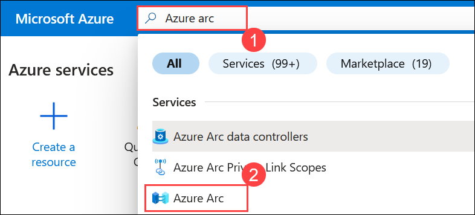
  
1. On the **Azure Arc** page, select **Machines (1)** under **Infrastructure** from left pane, click on **Onboard/Create (2)**, then **Onboard existing machine (3)**.
    
    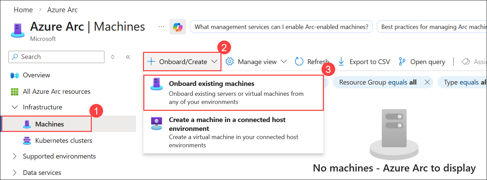
    
1. On the **Add servers with Azure Arc** page, In the **Basics** section, add the following details:
     
   - Subscription: **Select default subscription**
    
   - Resource group: **SmartHotelRG (1)**
  
   - Region: Select **<inject key="Region" enableCopy="false" /> (2)**
   
   - Operating system: **Windows (3)**
   
   - Leave other values as default and click on **Next (4).**

        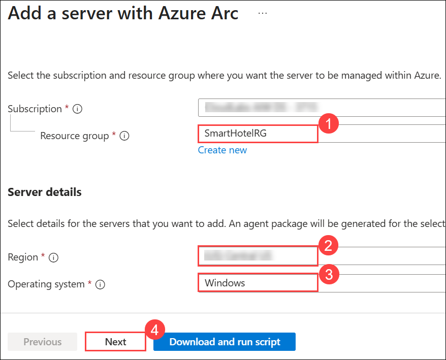

1. In the **Tags** section, leave the values as default and click on **Next**.

     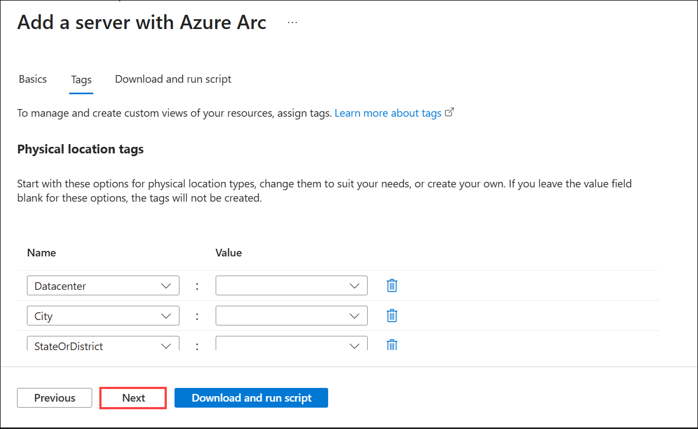

1. In the **Download and run script** section, click **copy (1)** icon to copy the entire script. Paste it into Notepad or your preferred text editor, as you will need it in the upcoming steps, then click on **Close (2)**.

    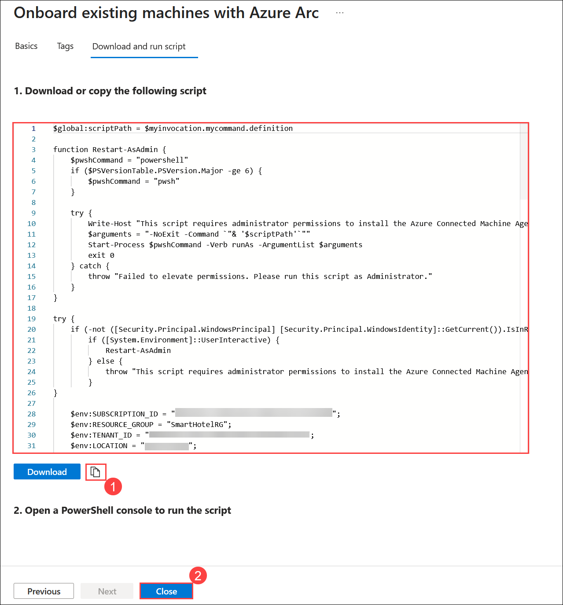
    
1. Go to the **Start** button in the VM, type **Hyper-V Manager (1)** and select **Hyper-V Manager (2)**.

    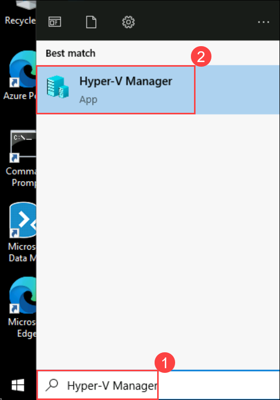

   > **Note:** You can also open the **Hyper-V manager** by clicking on the icon that is present in the taskbar. 
    
1. In Hyper-V Manager, select **HOSTVMS<inject key="DeploymentID" enableCopy="false" />**. 
  
    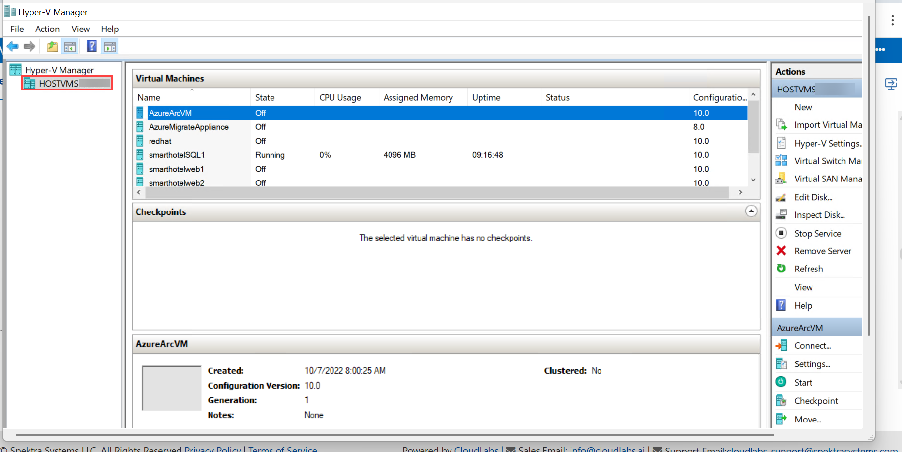

 1. In the Hyper-V Manager, select the **AzureArcVM** VM and you will see the state as **Running**.

    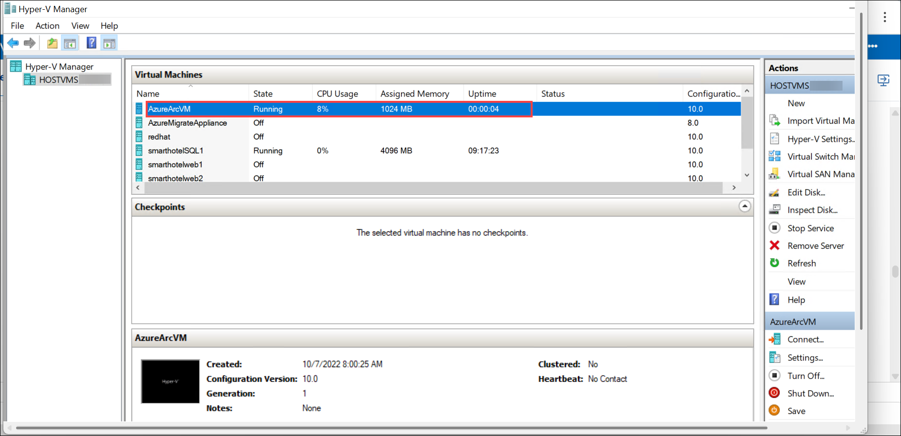  

    >**Note:** If you are unable to find the state for the **AzureArcVM (1)** VM as Running, then select **Start (2)** in the Actions pane on the right.

    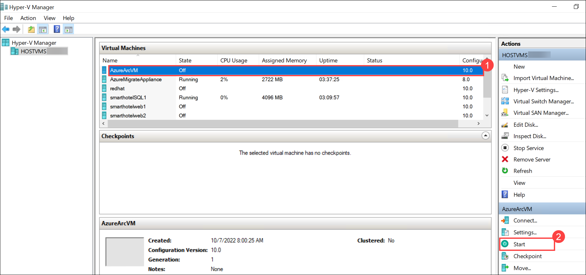    
    
1. In Hyper-V Manager, select the **AzureArcVM (1)** VM, then select **Connect (2)** in the Actions pane on the right.

    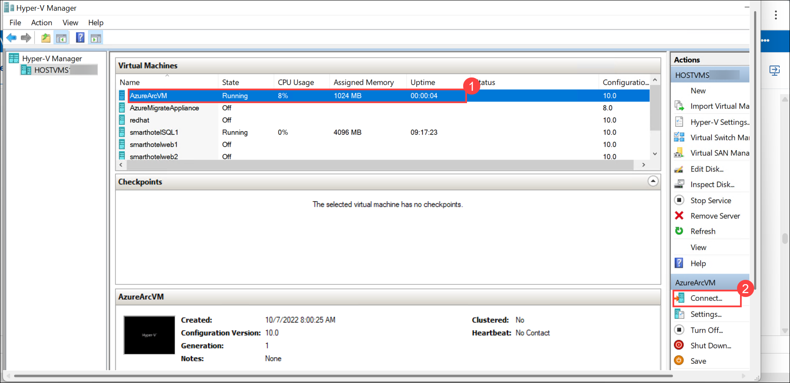  
    
1. Under Connect to AzureArcVM, click on **Connect** and then log into the VM with the **Administrator password**: **<inject key="SmartHotel Admin Password" />** (If the copy/paste is not working in the hyper-V machine, please try typing the password. The login screen may pick up your local keyboard mapping, use the 'eyeball' icon to check).
 
    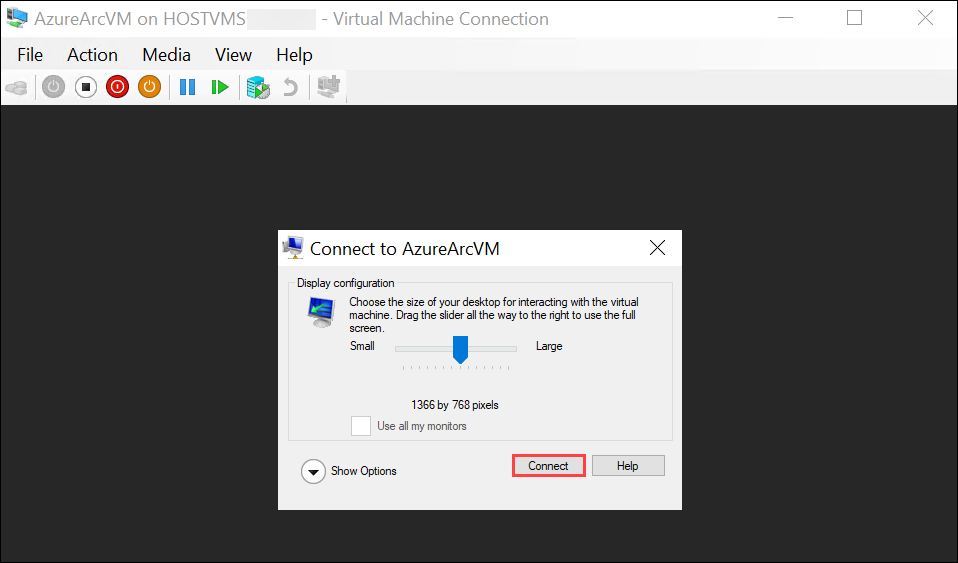
    
1. From the **Start** menu of the AzureArcVM, search for **Windows Powershell (1)** and right click on **Windows Powershell (2)** and select **Run as adminstrator (3)**.

    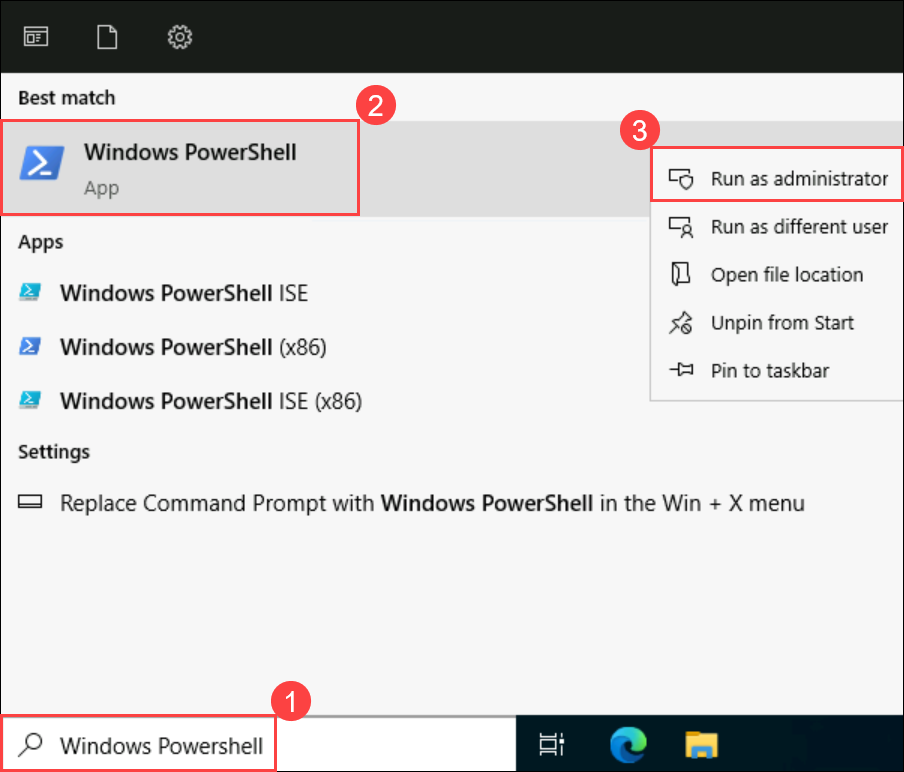
      
1. In PowerShell, run the following command to set the execution policy as unrestricted.

    ```
    Set-ExecutionPolicy -ExecutionPolicy unrestricted
    ```
   >**Note:** If you get an option, **"Do you want to change the execution policy?"**, please type **A** and press Enter. 

1. Now, run the whole script that you copied in Notepad earlier in **step 5**.

1. After running the script, packages will be installed, and then you will be directed to a pop-up browser page to log into your Azure account for authentication purposes. Use the below Azure credentials:

    >**Note:** On the Welcome to Microsoft Edge page, select  **Start without your data**, on **Stay current with your browsing data** select **Confirm and continue**, and on the help for importing Google browsing data page, select the  **Continue without this data**  button. Then, proceed to select  **Confirm and start browsing**  on the next page has a context menu.

    - Enter your **Username/Email**: **<inject key="AzureAdUserEmail"></inject>** **(1)**  in the Sign in field. Click **Next (2)** to continue.

       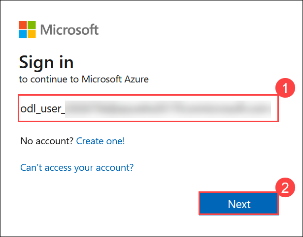
    
    - Enter **Temporary Access Pass**: **<inject key="AzureAdUserPassword"></inject>** **(1)** and click **Sign in** **(2)**

       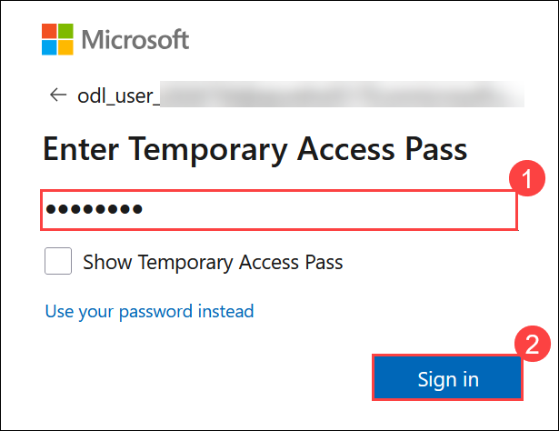

   > **Note:** Move back to the PowerShell pane, and now you have connected your AzureArcVM to Azure successfully.
    
    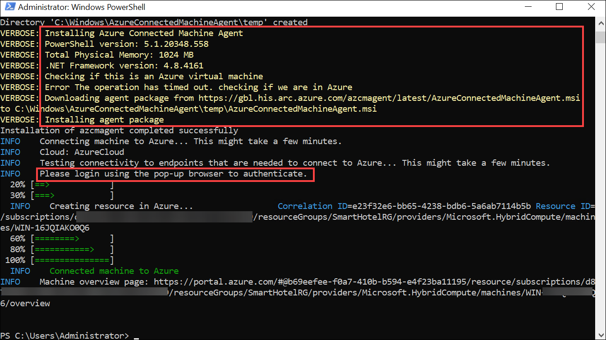
     
 1. Close the AzureArcVM, navigate to **Azure Arc** page in the Azure portal, select **Machines (1)** under **Azure Arc resources** and now verify that a server is connected successfully **(2)**.

    >**Note:** The name of the new server added could be different. You should refresh to see the new server.
    
    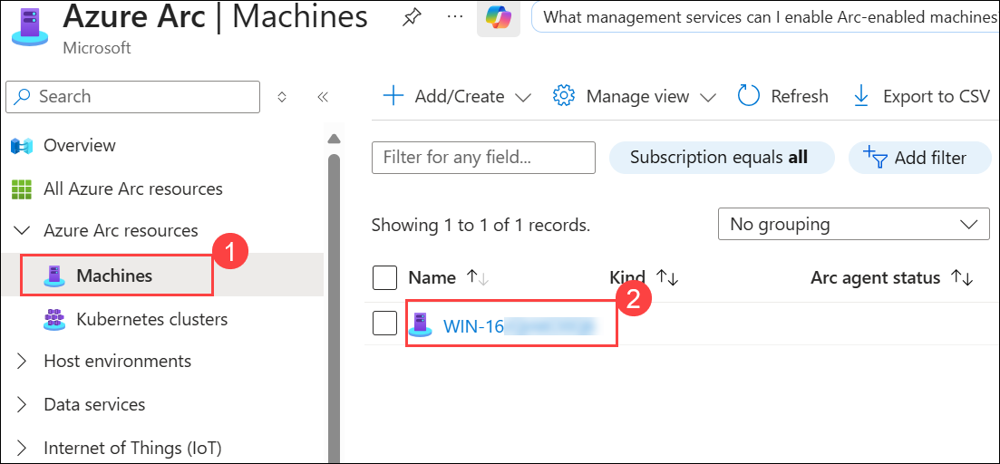
    
## Summary

In this lab, you successfully onboarded an on-premises Windows virtual machine to Azure using Azure Arc. You installed and configured the Azure Connected Machine agent, authenticated the machine with Azure, and verified that it appears as an Azure Arc-enabled server in the Azure portal.

# Conclusion

In this hands-on lab series, you have completed an end-to-end **Azure migration readiness and hybrid management workflow**. You discovered on-premises infrastructure using **Azure Migrate**, created detailed server assessments, analyzed workload dependencies through Log Analytics integration, and evaluated SQL database compatibility using **Azure Data Studio**. You assessed migration paths for both **Azure SQL Database** and **Azure SQL Managed Instance**, identifying feature readiness and compatibility considerations. Finally, you extended Azure management to on-premises resources by onboarding a server with **Azure Arc**, enabling centralized governance and control. Together, these exercises demonstrated a complete **discover, assess, plan, and hybrid-manage migration strategy** for Windows and SQL workloads in Azure.

## You have successfully completed this lab !
 

