## Exercise 3: Azure Arc-enable on-premises VM

Duration: 45 minutes

In this exercise, you will Azure Arc-enable a Windows Server VM that Tailspin has on-premises. This VM is being Arc-enabled since there are no plans to migrate it to Azure, but Tailspin would like to simplify the management of all their VMs in a single place. Azure Arc provides the functionality to manage Azure and on-premises VMs in a single place giving Tailspin Toys exactly what they are looking for to simplify VM management and administration.

   - [Exercise 3: Azure Arc-enable on-premises VM](#exercise-3-azure-arc-enable-on-premises-vm)
   
       - [Task 1: Generate Azure Arc script to add server](#task-1-generate-azure-arc-script-to-add-server)
    
       - [Task 2: Run script to add server to Azure Arc](#task-2-run-script-to-add-server-to-azure-arc)
    
       - [Task 3: Verify Azure Arc-enabled VM](#task-3-verify-azure-arc-enabled-vm)

### Task 1: Generate Azure Arc script to add server

1. Sign in to the [Azure Portal](https://portal.azure.com). 

2. In the **Search resources, services, and docs** box at the top of the portal, search for **Azure Arc**, then select the **Azure Arc** service.

    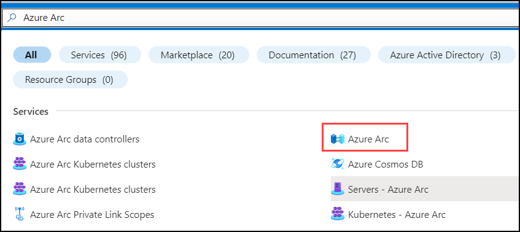

3. On the **Azure Arc** pane, select the **Infrastructure** tab, then select the **Add** button under **Servers**.

    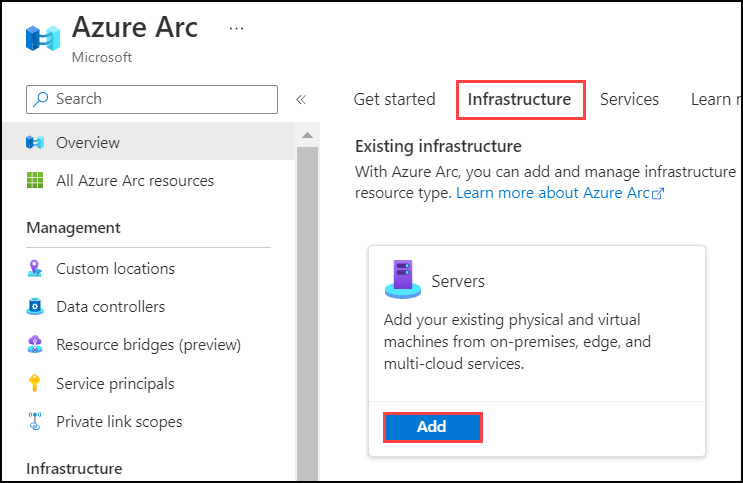

4. Under **Add a single server** select **Generate script**.

    

5. On the **Add a server with Azure Arc** pane, read the requirements of Azure Arc that are listed, then select **Next**.

    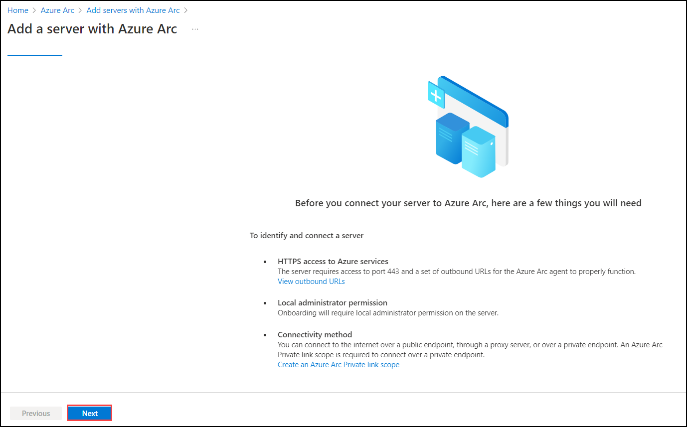

6. On the **Resource details** tab, enter the following values, then select **Next**.

    - **Resource group**: Select the Resource Group created for this lab. For example: `tailspin-rg`.
    - **Region**: `Central US`
    - **Operating system**: `Windows`
    - **Connectivity method**: `Public endpoint`

    

7. On the **Tags** tab, enter the following tag values to identify this server, then select **Next**:

    - **Datacenter**: `headquarters`
    - **City**: `Milwaukee`
    - **StateOrDistrict**: `WI`
    - **CountryOrRegion**: `USA`

    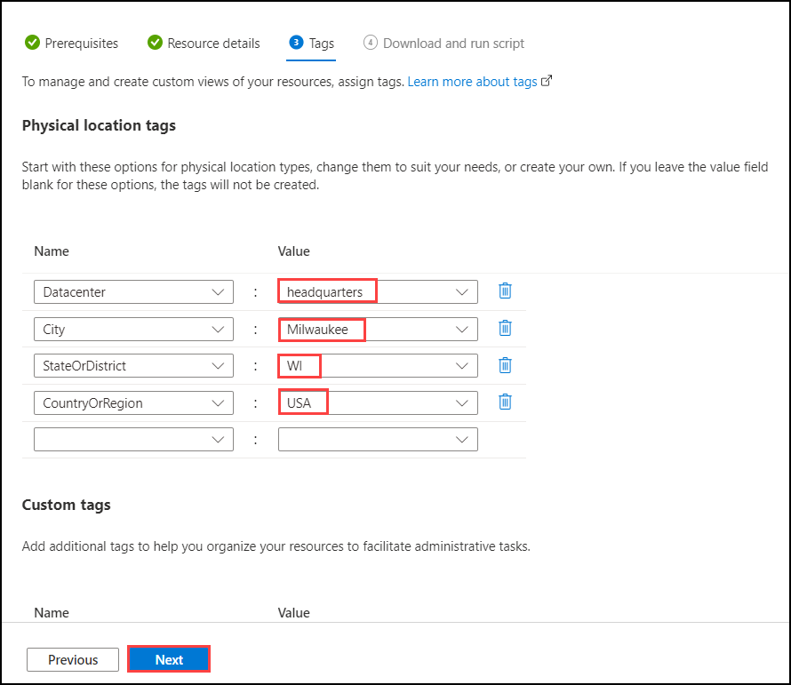

8. On the **Download and run script** tab, select **Download** to download the generated script. By default, the script named `OnboardingScript.ps1` will be saved to the `Downloads` folder.

    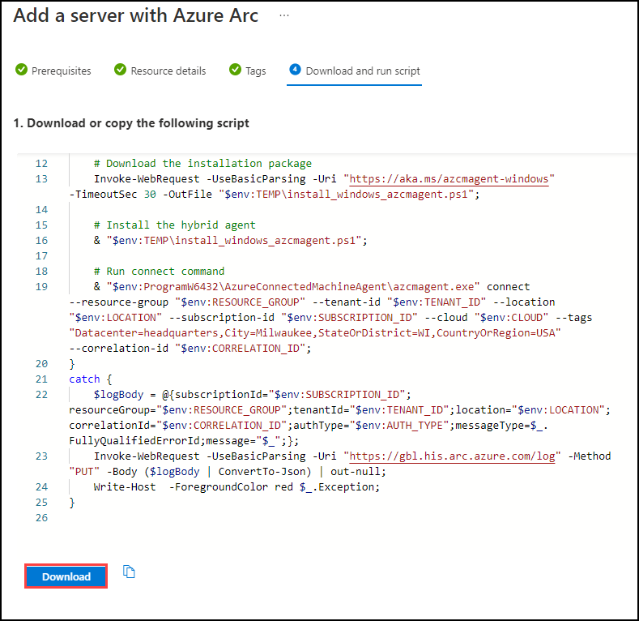

### Task 2: Run script to add server to Azure Arc

1. In the Azure Portal, navigate to the Resource Group **tailspin-rg**, then select the `tailspin-onprem-hyperv-vm` virtual machine resource. This is the simulated on-premises Hyper-V host VM.

    

2. On the left, select **Bastion** under **Operations**.

    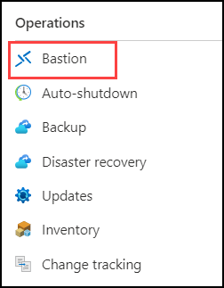

3. Enter the **Username** and **Password**, then select **Connect**.

    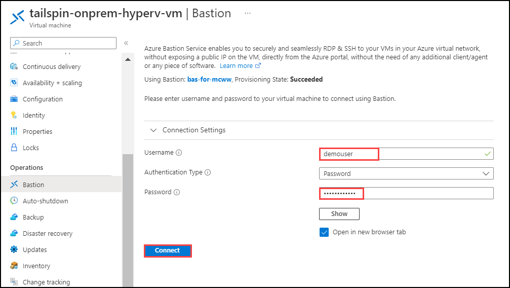

    > **Note**: Credentials for logging in to the VM :
    - **Username**: `demouser`
    - **Password**: `demo!pass123`

4. Once connected to the Hyper-V Host VM, open the **Start menu**, then search for and run the **Hyper-V Manager**.

    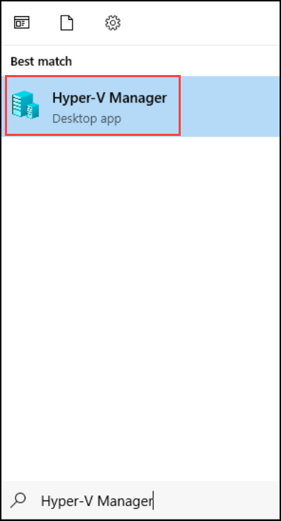

5. Within the **Hyper-V Manager**, double-click the **OnPremVM** VM to connect to it.

    

6. Once connected to the **OnPremVM** VM within Hyper-V, sign in using the **Administrator** account and the password of `demo!pass123`.

    > **Note**: If you encounter that the **OnPremVM** has **No Internet Connection**, go back into the `tailspin-onprem-hyperv-vm` Hyper-V Host VM and perform the following steps:
    > - Open the **Network Connections**
    > - Locate the **Ethernet** connection and right-click it.
    > - Select **Properties**
    > - Select the **Sharing** tab
    > - Disable and re-enable **Internet Connection Sharing** on this connection.
    >
    > You may see a warning message when disabling it and re-enabling it, but it will still work to restore Internet Connection Sharing with the **OnPremVM** that is connected through the Host VM's network connection.
    >
    > 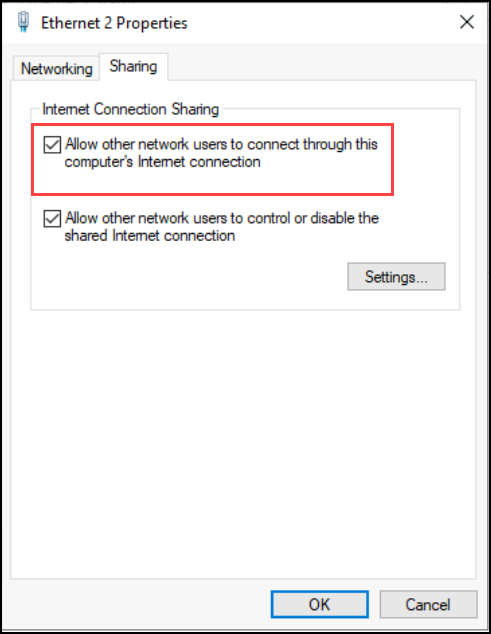

    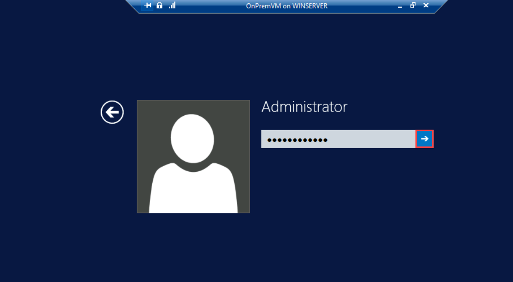
    
7. Within the **OnPremVM**, open **Internet Explorer**, go to the following link to download the Windows Update for installing **PowerShell 5.1**, and run it. This will install PowerShell 5.1 on the Windows Server 2012 R2 VM, since this is the version of PowerShell required by the Azure Arc script.

    <https://go.microsoft.com/fwlink/?linkid=839516>
    
    - Click on **Open**.
    
    
    
    - Accept the license terms by clicking on **I Accept**. 
    
    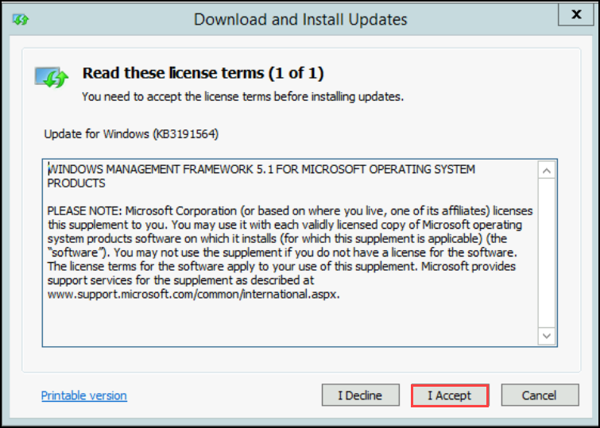
    
    - On **Download and Install Updates** click on **Restart Now**.
    
    

8. Within the **OnPremVM**, open **Internet Explorer**, go to the following link to download the .NET Framework 4.8, and install it. The Azure Arc script will install the **Azure Connected Machine Agent** which requires **.NET Framework 4.6 or later**.

    <https://go.microsoft.com/fwlink/?LinkId=2085155>

    > **Note**: The .NET Framework installer will display a **Blocking Issues** box with a note that another update needs to be installed.
    > The following 2 updates will need to be installed in the following order:
    > - Install KB2919442 from <https://www.microsoft.com/en-us/download/details.aspx?id=42153>
    > - Install KB2919355 from <https://www.microsoft.com/en-us/download/details.aspx?id=42334>
    >
    > Be sure to restart the VM after installing the updates, before you continue with the .NET Framework install.
    >
    > 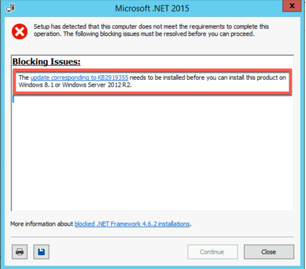
    - Once the **.NET Framework** is installed on **Download and Install Updates** click on **Restart Now**.
    
     

9. Within the **OnPremVM**, open the **Windows PowerShell ISE**, and create a new script file.

10. Paste in the contents of the Azure Arc `OnboardingScript.ps1` script that was previously downloaded.

    > **Note**: Within the Hyper-V Virtual Machine Connection window, you may need to use the **Clipboard** -> **Type clipboard text** menu option to paste into the **OnPremVM**.
     
     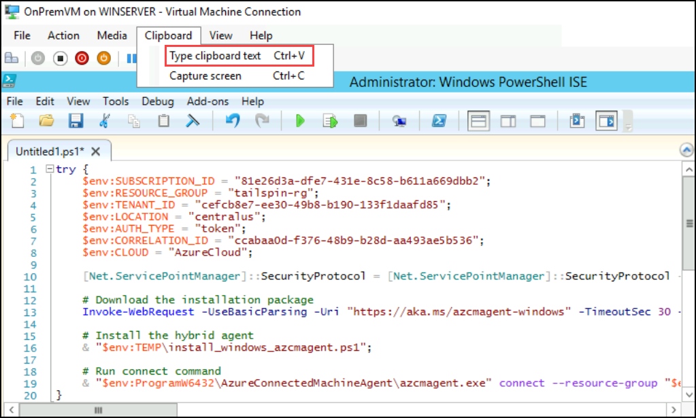

11. Run the full script. This will install the Azure Arc agent and Arc-enable the VM. When the script opens up a browser window, enter your credentials to authenticate with Azure.

    > **Note**: When the Azure Arc script opens a new browser window to authenticate you with Azure, be sure to use an Organization Account with permissions to create `Microsoft.HybridCompute/machines` resources. Using a Personal Account is not supported and will result in a `AZCM0042: Failed to Create Resource` error message.
    
    
    
    

12. When the script finishes executing successfully, a message stating "**Connected machine to Azure**" will be shown, along with the Azure Portal resource URL for the Azure Arc-enabled Server.

    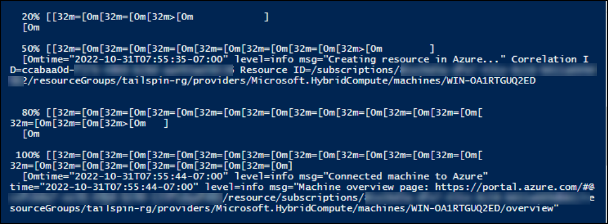

### Task 3: Verify Azure Arc-enabled VM

1. In the Azure Portal, navigate to the Resource Group for the lab. Scroll down and locate the Azure resource of type **Server - Azure Arc** and select it.

    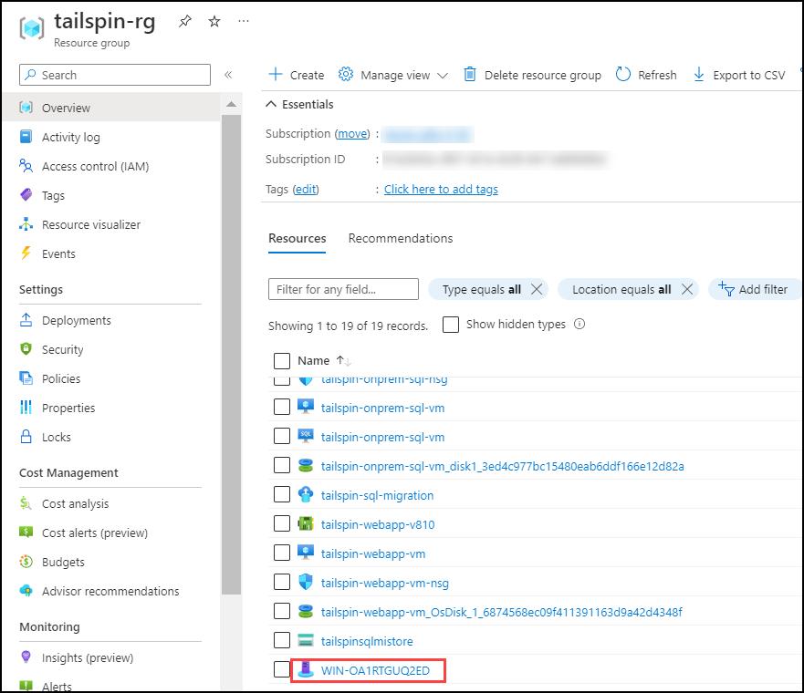

    > **Note**: The on-premises VM has been Azure Arc-enabled and can be managed alongside other Azure resources. This is enabled by the **Azure Connected Machine Agent** running on the VM that facilitates the interaction between Azure and the Azure Arc-enabled VM.

2. This is the **Server - Azure Arc** pane for the on-premises virtual machine that was just Azure Arc-enabled. The **Status** shows **Connected** to signify that the Azure Arc-enabled virtual machine is connected to Azure. Also, notice that the **Computer Name** and **Operating System** of the virtual machine are displayed.

    

3. From here, there are several **Azure Arc** capabilities available to use for managing the Azure Arc-enabled virtual machine.

    

4. Select **Extensions** under **Settings**. This is where you can install Extensions on the Azure Arc-enabled virtual machine. For example, the **Custom Script Extension for Windows - Azure Arc** extension can be used to download PowerShell scripts and files from Azure storage, and launch a PowerShell script on the machine.

    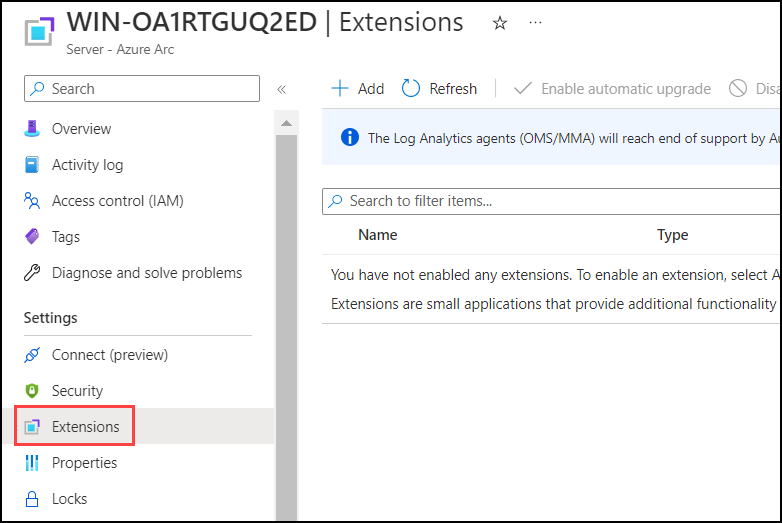
