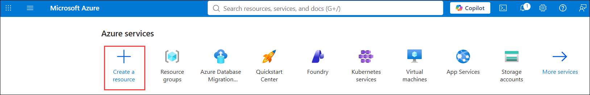
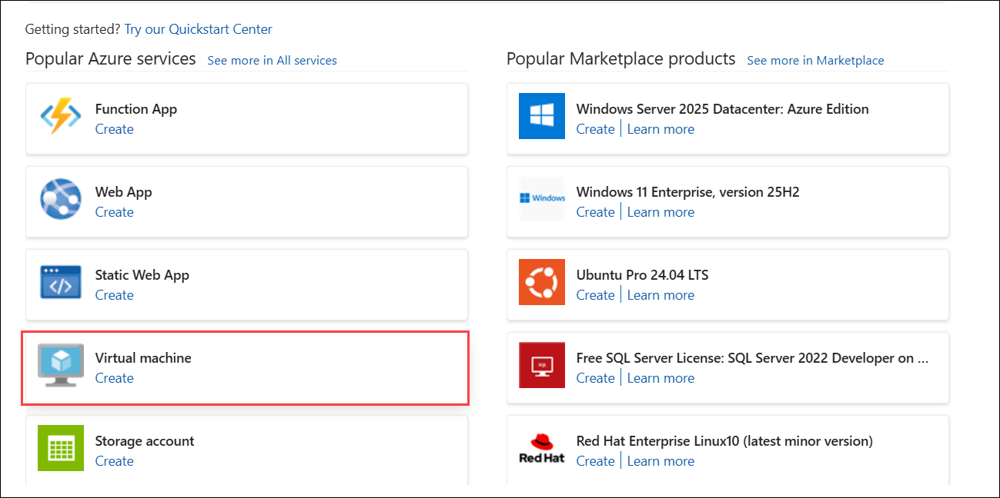
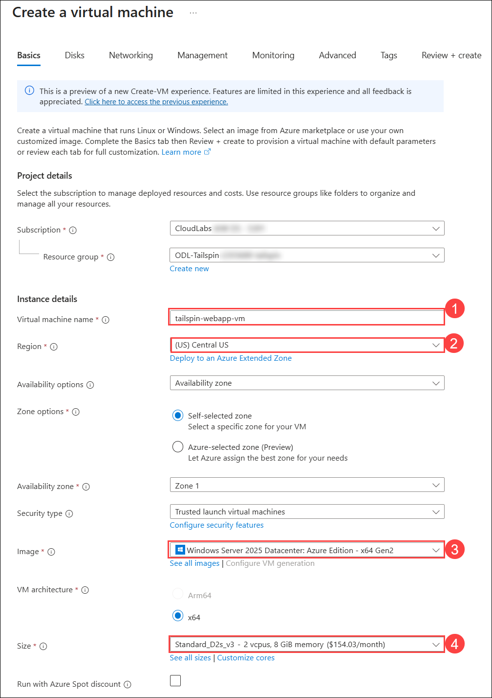
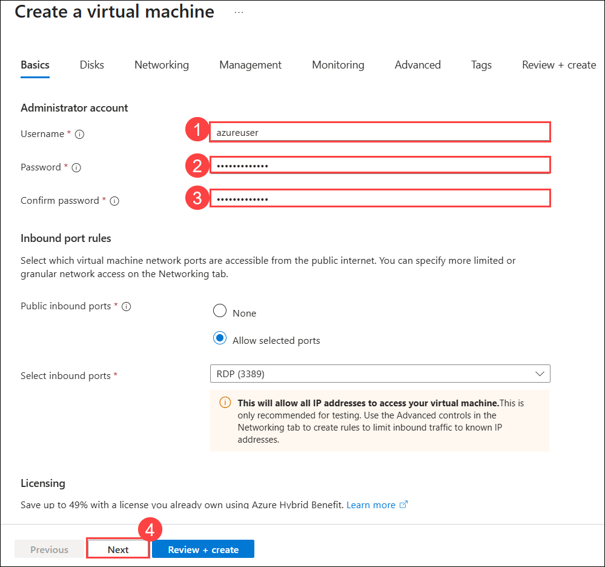
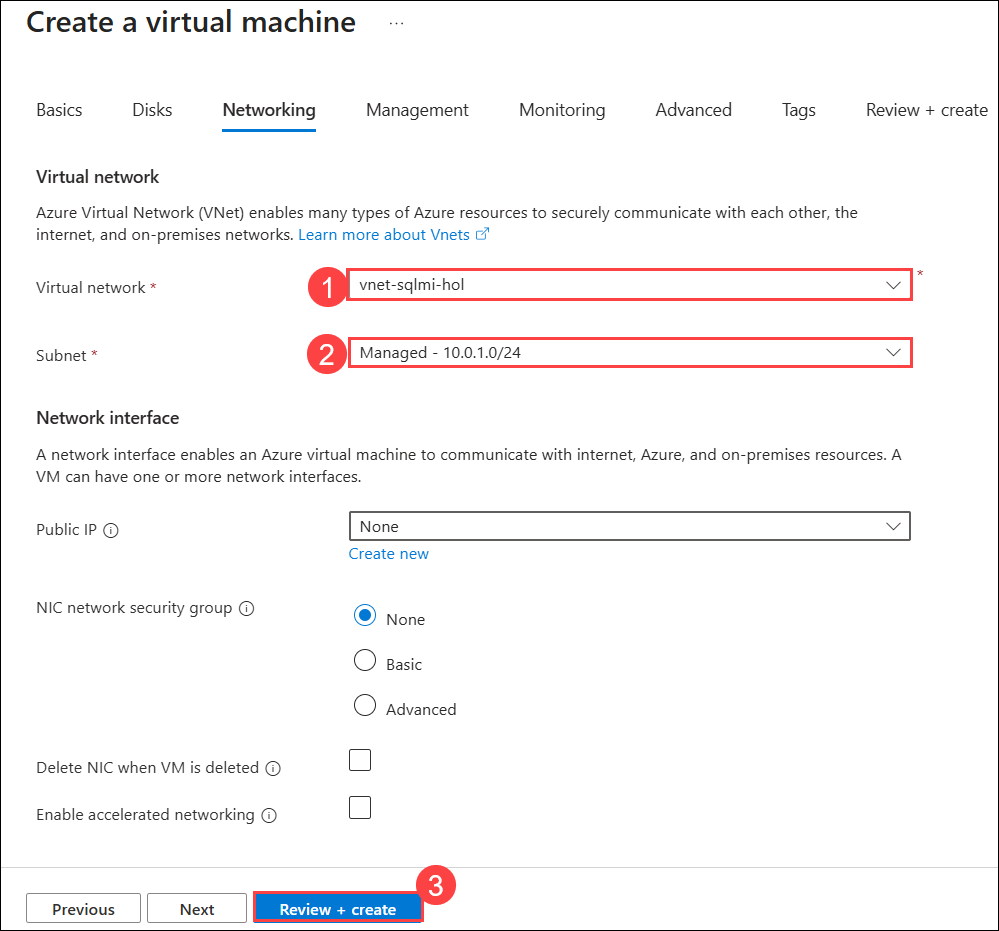
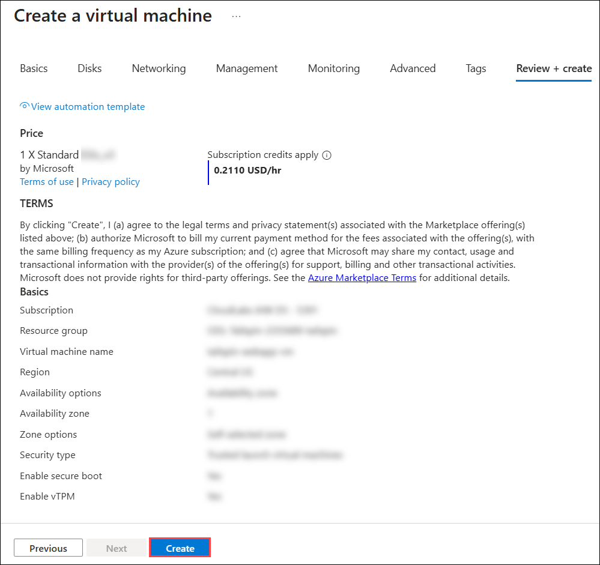
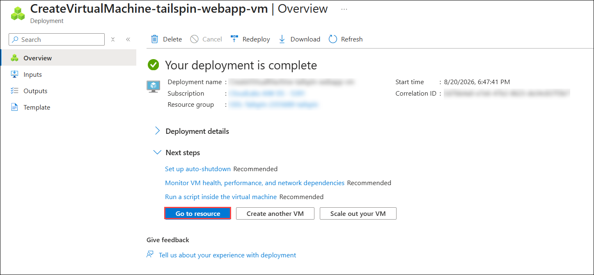
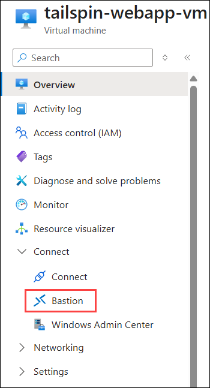
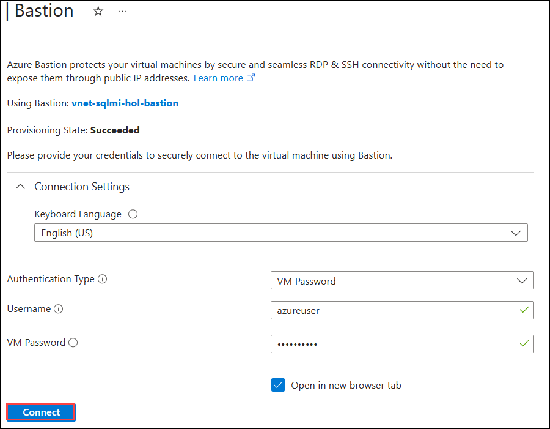
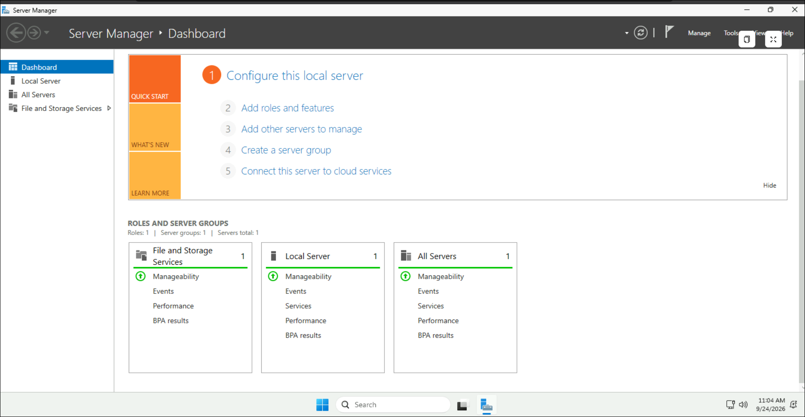

# Exercise 2: Create VM to migrate web application

### Estimated Duration: 60 Minutes

## 📘 Lab Scenario

In this exercise, you create a new **Windows Server 2025 Datacenter: Azure Edition** virtual machine that will be the destination for migrating Tailspin Toys' web application to Azure. You then connect to it securely using **Azure Bastion**. Windows Server Datacenter: Azure Edition is a virtual-only edition that runs as an Azure virtual machine and includes capabilities such as Hotpatching, which installs security updates without requiring a restart.

## 📋 Overview

This exercise provisions the Azure virtual machine that will host the migrated web application. You create the virtual machine inside the lab virtual network, keep it off the public internet by omitting a public IP address, and then validate secure administrative access using Azure Bastion.

> **Note:** Migrating an application to Azure is not only about moving code. The destination server has to sit in the right network so that it can reach the migrated database, and administrators have to be able to reach the server without exposing it to the internet. This exercise sets up both.

## 🎯 Objectives

In this exercise, you will complete the following tasks:

- **Task 1:** Create a Windows Server 2025 Datacenter: Azure Edition virtual machine
- **Task 2:** Connect to the virtual machine using Azure Bastion

---

## Task 1: Create a Windows Server 2025 Datacenter: Azure Edition virtual machine

In this task, you provision the virtual machine that will host the migrated web application.

1. Sign in to the **Azure portal** at `https://portal.azure.com` using your lab credentials:

   - **Username:** <inject key="AzureAdUserEmail"></inject> 
   - **Password:** <inject key="AzureAdUserPassword"></inject>

1. On the Azure portal home page, select **Create a resource**.

   

1. On the **Create a resource** page, select **Virtual machine** under **Popular Azure services**. Alternatively, search for **Virtual machine** and then select **Create**.

   

1. On the **Create a virtual machine** > **Basics** tab, enter the following values under **Project details** and **Instance details**:

   - **Subscription:** The lab subscription
   - **Resource group:** **tailspin-<inject key="DeploymentID" enableCopy="false"/>**
   - **Virtual machine name (1)**: **tailspin-webapp-vm**
   - **Region (2)**: **Central US**
   - **Image (3)**: **Windows Server 2025 Datacenter: Azure Edition - x64 Gen2**
   - **Size (4)**: **Standard_D2s_v3**

   > **Note:** If the size is not listed, select **See all sizes** and search for it.

   > **Note:** **Azure Edition** is available only on Azure and cannot be installed on your own hardware. It adds capabilities that depend on the Azure platform, the most visible being **Hotpatching**, which applies security updates to running processes in memory so the server does not have to restart. For an application server, that means far fewer maintenance windows.

   > **Note:** Select **Central US** so that the virtual machine lands in the same region as the lab virtual network and the shared SQL Managed Instance. A virtual machine cannot join a virtual network in a different region.

   

1. Under **Administrator account**, enter the following values, and then select **Next (4)**:

   - **Username (1)**: azureuser
   - **Password (2)**: azureuser!pass123
   - **Confirm password (3)**: azureuser!pass123

   > **Note:** Azure rejects some common administrator names, such as **admin** and **administrator**. Use the username shown above.

   

1. Select **Next: Disks >**, and then select **Next: Networking >** to reach the **Networking** tab. Enter the following values so that the virtual machine joins the lab virtual network with no public IP address, and then select **Review + create (4)**:

   - **Virtual network (1)**: **vnet-sqlmi-hol**
   - **Subnet (2)**: **Managed**
   - **Public IP (3)**: **None**

   > **Note:** Setting the public IP address to **None** keeps the virtual machine off the public internet. You will connect to it securely using Azure Bastion in the next task.

   > **Note:** Placing the virtual machine in **vnet-sqlmi-hol** puts it in the same virtual network as the SQL Managed Instance you migrated to in Exercise 1. The application can then reach the database over the private endpoint on port 1433, without that traffic ever leaving the Azure backbone.

   > **Note:** Select the **Managed** subnet, not **ManagedInstance**. The **ManagedInstance** subnet is delegated to the SQL Managed Instance service and cannot host virtual machines.

   

1. After the **Validation passed** message appears, select **Create** to begin provisioning the virtual machine.

   > **Note:** If validation fails, expand the error message at the top of the page. The most common causes are a virtual machine name that is already in use and a size that is unavailable in the selected region.

   

1. Wait for the deployment to complete, and then select **Go to resource**.

   > **Note:** Deployment takes two to three minutes.

   

---

## Task 2: Connect to the virtual machine using Azure Bastion

Because the virtual machine has no public IP address, you cannot connect to it directly over the internet. In this task, you use Azure Bastion to open a secure RDP session from inside the Azure portal.

1. On the **tailspin-webapp-vm** virtual machine page, select **Connect (1)** at the top, and then select **Connect via Bastion (2)**. Alternatively, select **Bastion** from the left menu under **Connect**.

   

1. On the **Bastion** pane, enter the following credentials, and then select **Connect**:

   - **Username:** azureuser
   - **Password:** azureuser!pass123

   > **Note:** The Azure Bastion host, named similar to **tailspin-hub-bastion**, was created as part of the lab environment, so you can connect without deploying anything extra.

   > **Note:** Azure Bastion delivers the RDP session to your browser over HTTPS on port 443. Port 3389 is never exposed to the internet, which removes one of the most commonly attacked entry points on a server.

   

1. A new browser tab opens with the virtual machine connected over RDP through Azure Bastion. This confirms that secure remote access works.

   > **Note:** If the session does not open, check that your browser is not blocking pop-up windows for the Azure portal.

   

1. To end the session, close the browser tab.

   > **Note:** Now that the Windows Server 2025 virtual machine exists in Azure, Tailspin Toys can update its CI/CD pipelines in Azure DevOps to deploy the web application code to this virtual machine in preparation for migrating the application to Azure.

## Task 3: Review how the web application connects to the migrated database **(Read-Only)**

> **Note:** This is a **Read-Only** task. There are no steps to perform. Read through it to understand what Tailspin Toys does next with the virtual machine you just created, and why it was placed in this specific virtual network.

The virtual machine you created in Task 1 is the destination for the Tailspin Toys web application. The application code itself is deployed by Tailspin Toys' existing CI/CD pipeline in Azure DevOps, which is outside the scope of this lab. What matters for the migration is the change the application has to make in order to reach its data.

### The connection string before migration

On-premises, the Tailspin Toys web application connected to the SQL Server instance running on **tailspin-onprem-<inject key="DeploymentID" enableCopy="false"/>-sql-vm** using a connection string similar to the following:

```
Server=tcp:SQLServer,1433;Database=WideWorldImporters;User ID=sa;Password=<password>;Trusted_Connection=False;Encrypt=False;
```

The server name is a local machine name, and encryption is switched off because all the traffic stayed inside the company network.

### The connection string after migration

Once the database has been migrated to Azure SQL Managed Instance, only the connection string changes. The application code, the queries, and the database schema stay the same, which is the main reason Tailspin Toys chose Managed Instance over a re-write:

```
Server=tcp:<SQL MI Host>,1433;Database=<Your Target Database Name>;User ID=sqlmiadmin;Password=<SQL MI Admin Password>;Trusted_Connection=False;Encrypt=True;TrustServerCertificate=True;
```

You can find the **SQL MI Host**, **SQL MI Admin Login**, **SQL MI Admin Password**, and **Your Target Database Name** values on the **Environment** tab of your lab environment.

Three things changed:

| Setting | Before | After |
| --- | --- | --- |
| Server | Local machine name | Managed Instance host name |
| Encrypt | False | **True** |
| TrustServerCertificate | Not set | True |

Encryption is now switched on because the connection crosses the Azure network rather than a single server room. Azure SQL Managed Instance requires encrypted connections.

### Why the virtual network placement matters

In Task 1 you placed the virtual machine in **vnet-sqlmi-hol**, the same virtual network that hosts the SQL Managed Instance. That single choice is what allows the connection string above to work on port **1433**.

- The application server and the Managed Instance are in the same virtual network, so the application reaches the Managed Instance over its **private endpoint**. The traffic never leaves the Azure backbone.
- Had the virtual machine been created in a separate virtual network, the Managed Instance would only have been reachable over its **public endpoint** on port **3342**, which means exposing the database to the internet and adding firewall rules for it.
- Because the virtual machine has no public IP address, the application server itself is not reachable from the internet at all. Public traffic would normally arrive through a load balancer or an application gateway placed in front of it.

### What Tailspin Toys does next

With the virtual machine in place, the remaining work for the application tier is:

1. Update the connection string in the application's configuration to the Managed Instance values shown above.
2. Point the existing Azure DevOps release pipeline at the new virtual machine instead of the on-premises server.
3. Run the application's test suite against the migrated database to confirm that queries behave the same way.
4. Switch DNS to the new environment once the tests pass.

None of these steps require changes to the application code, because Azure SQL Managed Instance offers near-complete compatibility with the SQL Server engine that Tailspin Toys ran on-premises.

### Cost considerations for this virtual machine

Two settings on this virtual machine affect what Tailspin Toys pays for it, and both are part of the business case for migrating rather than refreshing on-premises hardware:

- **Azure Hybrid Benefit**, available on the virtual machine's **Configuration** page, lets the organization apply its existing Windows Server licences with active Software Assurance to this virtual machine. The Azure bill then covers only the compute cost rather than the compute plus a new licence.
- **Hotpatching**, included with Windows Server Datacenter: Azure Edition, applies security updates to running processes in memory. The server restarts only for the quarterly baseline updates, which reduces both downtime and the operational effort of scheduling maintenance windows.

## Troubleshooting

**The Networking tab does not list vnet-sqlmi-hol.**
The virtual machine region does not match the virtual network region. Return to the **Basics** tab and confirm that **Region** is set to **Central US**.

**The Bastion connection fails or the session window stays blank.**
Allow pop-up windows for the Azure portal in your browser, and then select **Connect** again. If the virtual machine was only just created, wait a minute for it to finish starting.

**The Bastion sign-in is rejected.**
Use the **azureuser** credentials you set in Task 1, step 5, not your Azure portal credentials. The virtual machine has a local administrator account that is separate from your Azure account.

## 🧾 Summary

In this exercise, you accomplished the following:

- Created a Windows Server 2025 Datacenter: Azure Edition virtual machine to host the migrated web application.
- Placed the virtual machine in the lab virtual network with no public IP address.
- Verified secure remote desktop access to the virtual machine using Azure Bastion.

### You have successfully completed this exercise. Click on **Next >>** to proceed with the next exercise.

