# Exercise 2: Create a Virtual Machine to Host the Web Application

### Estimated Duration: 90 Minutes

## 📘 Lab Scenario

In this exercise, you create a new **Windows Server 2025 Datacenter: Azure Edition** virtual machine that will be the destination for migrating Tailspin Toys' web application to Azure. You then connect to it securely using **Azure Bastion**, and confirm that it can reach the database you migrated in Exercise 1. Windows Server Datacenter: Azure Edition is a virtual-only edition that runs as an Azure virtual machine and includes capabilities such as Hotpatching, which installs security updates without requiring a restart.

## 📋 Overview

This exercise provisions the Azure virtual machine that will host the migrated web application. You create the virtual machine inside the lab virtual network, keep it off the public internet by omitting a public IP address, and then validate secure administrative access using Azure Bastion.

You then connect from the new application server to the Azure SQL Managed Instance and inspect the migrated database, which confirms that the application tier and the data tier can reach each other privately.

> **Note:** Migrating an application to Azure is not only about moving code. The destination server has to sit in the right network so that it can reach the migrated database, and administrators have to be able to reach the server without exposing it to the internet. This exercise sets up both.

## 🎯 Objectives

In this exercise, you will complete the following tasks:

- **Task 1:** Create a Windows Server 2025 Datacenter: Azure Edition virtual machine
- **Task 2:** Connect to the virtual machine using Azure Bastion
- **Task 3:** Verify connectivity to the migrated database

## Task 1: Create a Windows Server 2025 Datacenter: Azure Edition virtual machine

In this task, you provision the virtual machine that will host the migrated web application.

1. Sign in to the **Azure portal** at `https://portal.azure.com` using your lab credentials:

   - **Username:** <inject key="AzureAdUserEmail"></inject>
   - **Password:** <inject key="AzureAdUserPassword"></inject>

1. On the Azure portal home page, select **Create a resource**.

   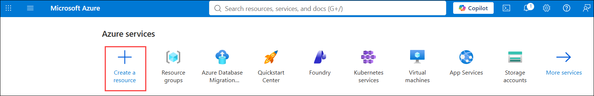

1. On the **Create a resource** page, select **Virtual machine** under **Popular Azure services**. Alternatively, search for **Virtual machine** and then select **Create**.

   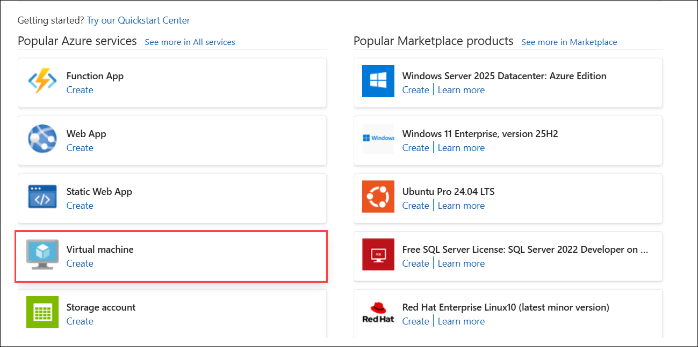

1. On the **Create a virtual machine** > **Basics** tab, enter the following values under **Project details** and **Instance details**:

   - **Subscription:** The lab subscription
   - **Resource group:** **tailspin-<inject key="DeploymentID" enableCopy="false"/>**
   - **Virtual machine name (1)**: **tailspin-webapp-vm**
   - **Region (2)**: **Central US**
   - **Image (3)**: **Windows Server 2025 Datacenter: Azure Edition - x64 Gen2**
   - **Size (4)**: **Standard_D2s_v3**

   > **Note:** If the size is not listed, select **See all sizes** and search for it.

   > **Note:** **Azure Edition** is available only on Azure and cannot be installed on your own hardware. It adds capabilities that depend on the Azure platform, the most visible being **Hotpatching**, which applies security updates to running processes in memory so the server does not have to restart. For an application server, that means far fewer maintenance windows.

   > **Note:** Select **Central US** so that the virtual machine lands in the same region as the lab virtual network and the shared SQL Managed Instance. A virtual machine cannot join a virtual network in a different region.

   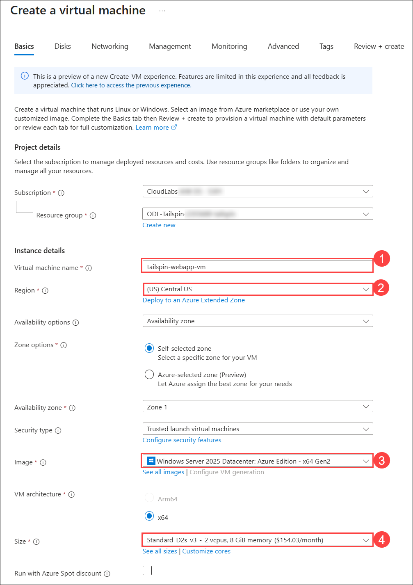

1. Under **Administrator account**, enter the following values, and then select **Next (4)**:

   - **Username (1)**: azureuser
   - **Password (2)**: azureuser!pass123
   - **Confirm password (3)**: azureuser!pass123

   > **Note:** Azure rejects some common administrator names, such as **admin** and **administrator**. Use the username shown above.

   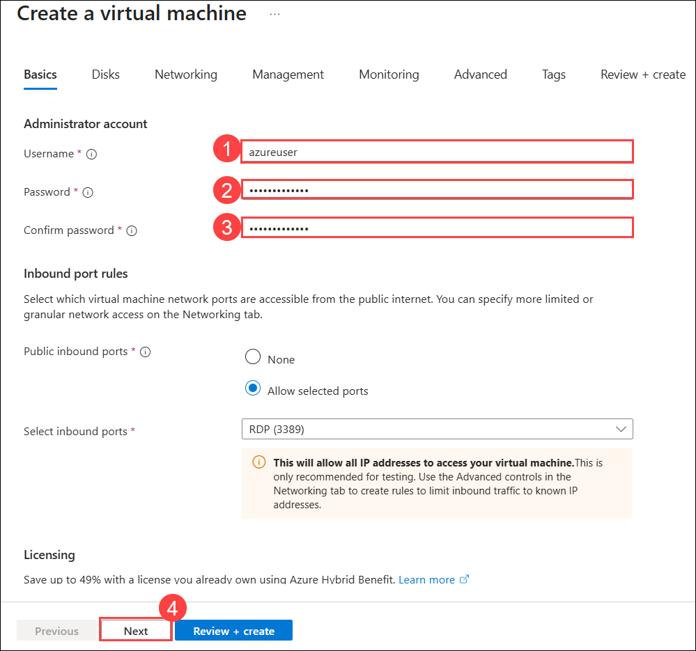

1. Select **Next: Disks >**, and then select **Next: Networking >** to reach the **Networking** tab. Enter the following values so that the virtual machine joins the lab virtual network with no public IP address, and then select **Review + create (4)**:

   - **Virtual network (1)**: **vnet-sqlmi-hol**
   - **Subnet (2)**: **Managed**
   - **Public IP (3)**: **None**

   > **Note:** Setting the public IP address to **None** keeps the virtual machine off the public internet. You will connect to it securely using Azure Bastion in the next task.

   > **Note:** Placing the virtual machine in **vnet-sqlmi-hol** puts it in the same virtual network as the SQL Managed Instance you migrated to in Exercise 1. The application can then reach the database over the private endpoint on port 1433, without that traffic ever leaving the Azure backbone.

   > **Note:** Select the **Managed** subnet, not **ManagedInstance**. The **ManagedInstance** subnet is delegated to the SQL Managed Instance service and cannot host virtual machines.

   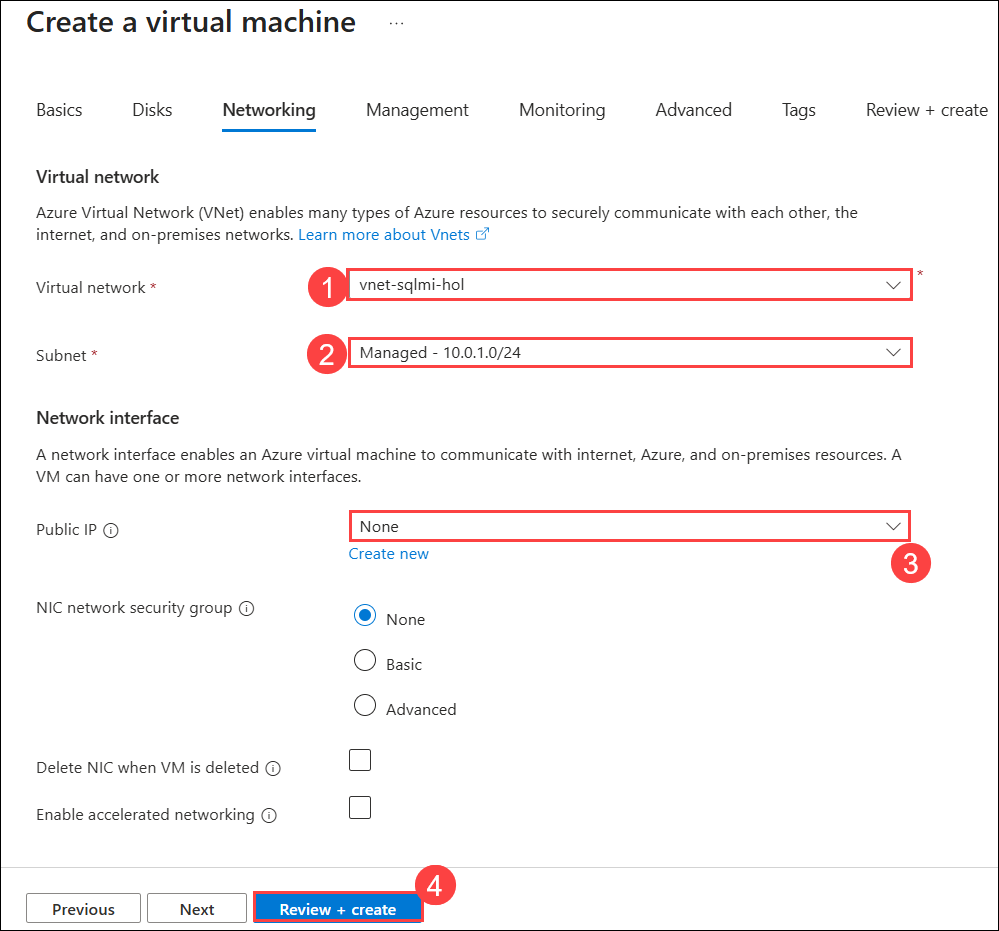

1. After the **Validation passed** message appears, select **Create** to begin provisioning the virtual machine.

   > **Note:** If validation fails, expand the error message at the top of the page. The most common causes are a virtual machine name that is already in use and a size that is unavailable in the selected region.

   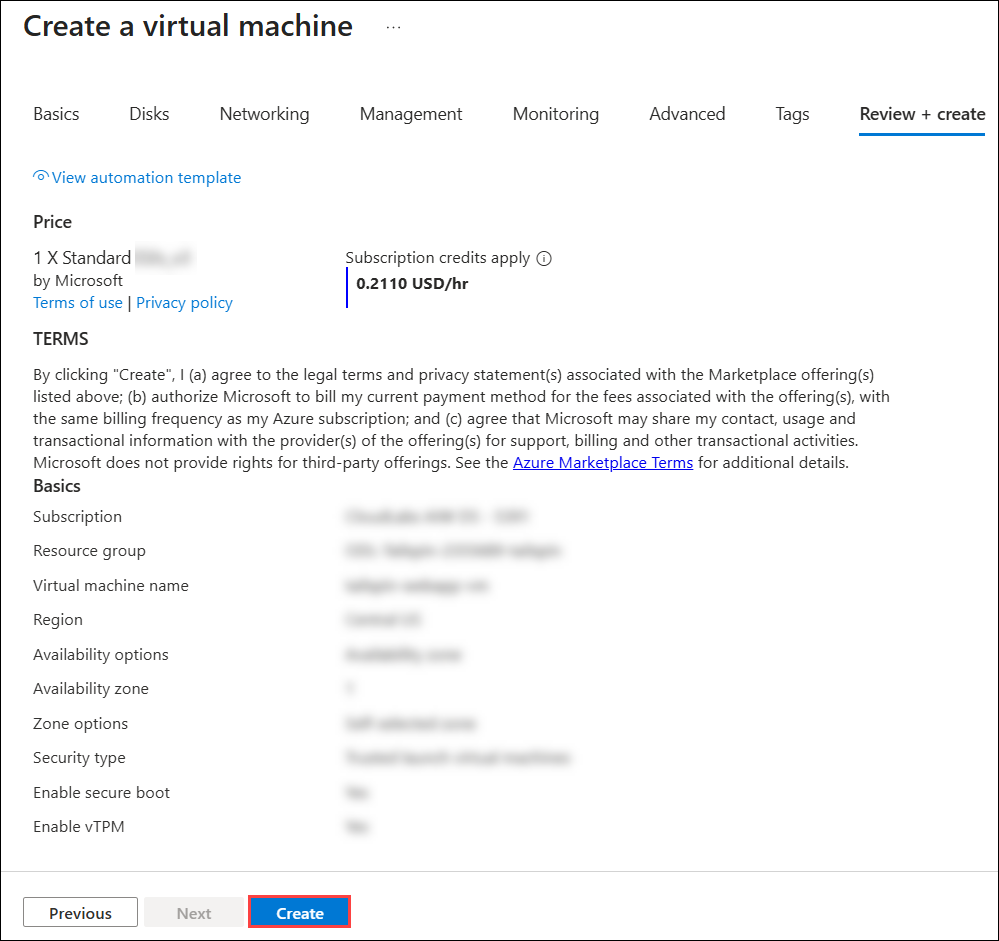

1. Wait for the deployment to complete, and then select **Go to resource**.

   > **Note:** Deployment takes two to three minutes.

   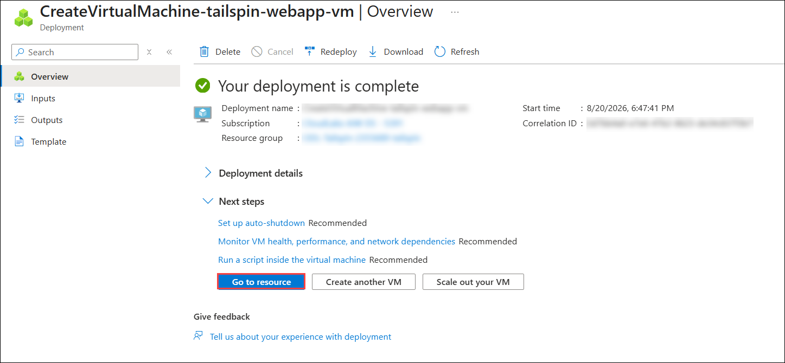

## Task 2: Connect to the virtual machine using Azure Bastion

Because the virtual machine has no public IP address, you cannot connect to it directly over the internet. In this task, you use Azure Bastion to open a secure RDP session from inside the Azure portal.

1. On the **tailspin-webapp-vm** virtual machine page, select **Connect (1)** at the top, and then select **Connect via Bastion (2)**. Alternatively, select **Bastion** from the left menu under **Connect**.

   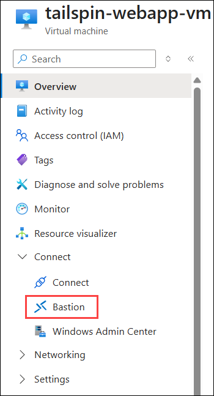

1. On the **Bastion** pane, enter the following credentials, and then select **Connect**:

   - **Username:** azureuser
   - **Password:** azureuser!pass123

   > **Note:** The Azure Bastion host, named similar to **tailspin-hub-bastion**, was created as part of the lab environment, so you can connect without deploying anything extra.

   > **Note:** Azure Bastion delivers the RDP session to your browser over HTTPS on port 443. Port 3389 is never exposed to the internet, which removes one of the most commonly attacked entry points on a server.

   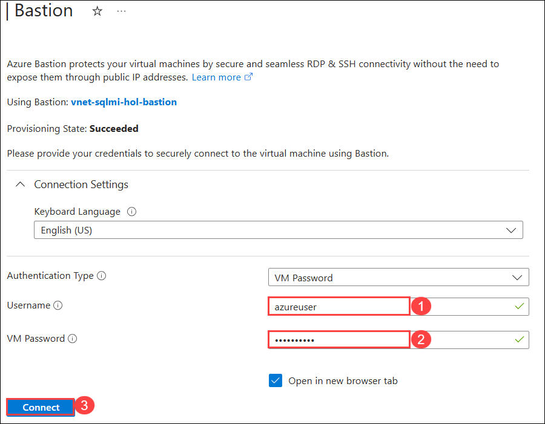

1. A new browser tab opens with the virtual machine connected over RDP through Azure Bastion. This confirms that secure remote access works.

   > **Note:** If the session does not open, check that your browser is not blocking pop-up windows for the Azure portal.

   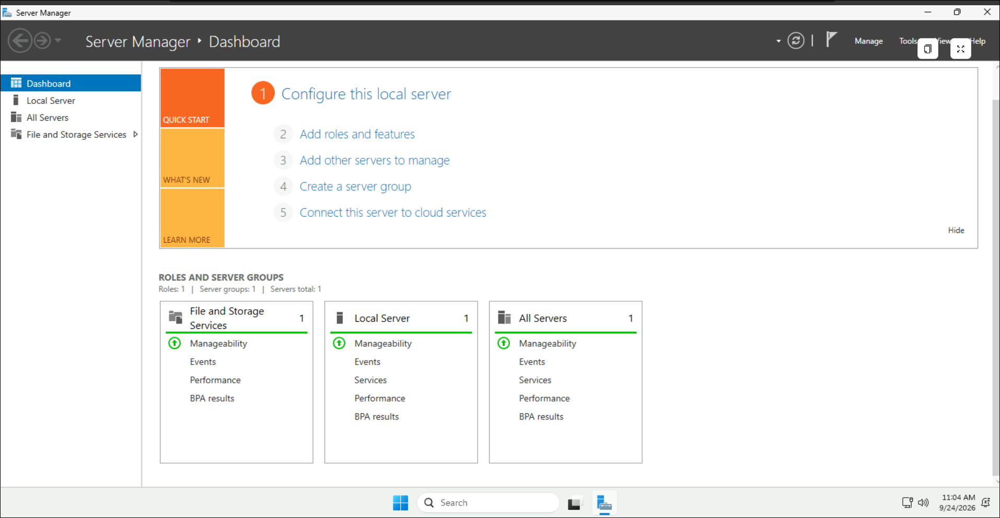

1. Keep this session open. You will continue working inside this virtual machine in the next task.

   > **Note:** Now that the Windows Server 2025 virtual machine exists in Azure, Tailspin Toys can update its CI/CD pipelines in Azure DevOps to deploy the web application code to this virtual machine in preparation for migrating the application to Azure.

## Task 3: Verify connectivity to the migrated database

Placing this virtual machine in **vnet-sqlmi-hol** is what allows the application to reach the Managed Instance privately. In this task you prove it, by connecting from the new application server to the database you migrated in Exercise 1.

1. Return to the Azure Bastion session for **tailspin-webapp-vm**. If you closed it, reconnect using the steps in Task 2.

1. Copy the following values from the **Environment** tab of your lab environment. You will need them in the steps that follow:

   - **SQL MI Host (1)**
   - **SQL MI Admin Login (2)**
   - **SQL MI Admin Password (3)**
   - **Your Target Database Name (4)**

   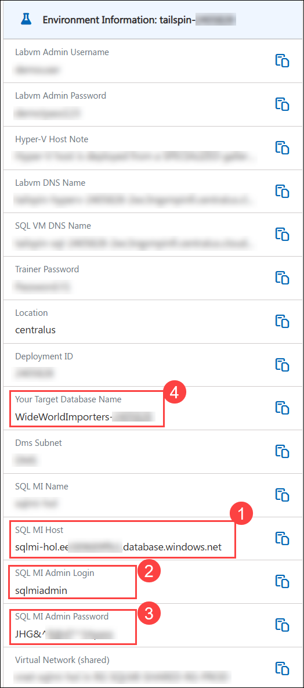

1. On the virtual machine, search for **Windows PowerShell ISE (1)**, right-click on **Windows PowerShell ISE (2)**, and then select **Run as administrator (3)**.

   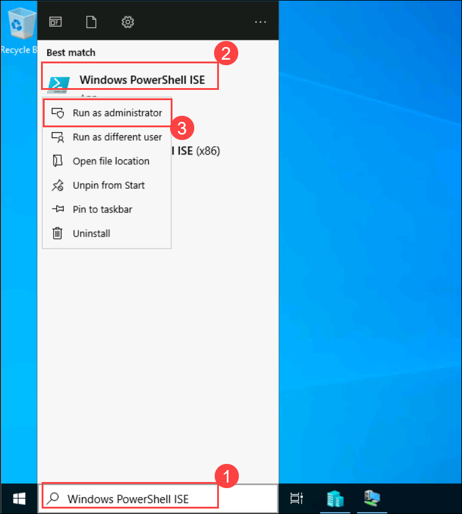

1. In the PowerShell ISE window, run the following command, replacing `<SQL MI Host>` with the value you copied in step 2:

   ```powershell
   Test-NetConnection -ComputerName "<SQL MI Host>" -Port 1433
   ```

   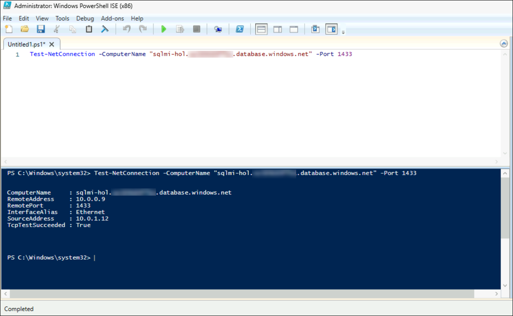

1. Confirm that the output shows **TcpTestSucceeded : True**.

   > **Note:** Port **1433** is the private endpoint of the Managed Instance. This test succeeds because the virtual machine you created in Task 1 sits in the **Managed** subnet of **vnet-sqlmi-hol**, the same virtual network as the Managed Instance. Had the virtual machine been created in a different virtual network, this test would fail and the application would have to reach the database over its public endpoint on port 3342 instead.

   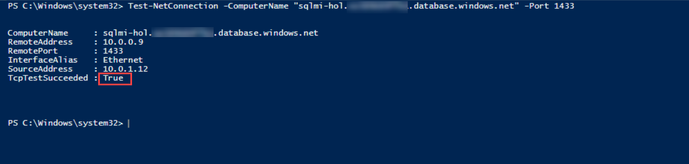

1. Now query the migrated database directly. In the same PowerShell ISE window, paste the following script, replacing the four placeholder values with the ones you copied in step 2, and then click on the green **Run Script** button or press the **F5** key:

   ```powershell
   $server   = "<SQL MI Host>"
   $database = "<Your Target Database Name>"
   $login    = "<SQL MI Admin Login>"
   $password = "<SQL MI Admin Password>"

   $connectionString = "Server=tcp:$server,1433;Database=$database;User ID=$login;Password=$password;Encrypt=True;TrustServerCertificate=True;"
   $connection = New-Object System.Data.SqlClient.SqlConnection($connectionString)
   $connection.Open()

   $command = $connection.CreateCommand()
   $command.CommandText = "SELECT @@VERSION"
   $command.ExecuteScalar()

   $command = $connection.CreateCommand()
   $command.CommandText = "SELECT COUNT(*) FROM sys.tables"
   "Tables in the migrated database: " + $command.ExecuteScalar()

   $connection.Close()
   ```

   > **Note:** Enter the password between the quotation marks exactly as it appears on the **Environment** tab. If the sign-in is rejected, check the password first, because a failed login here almost always means a mistyped value rather than a connectivity problem.

   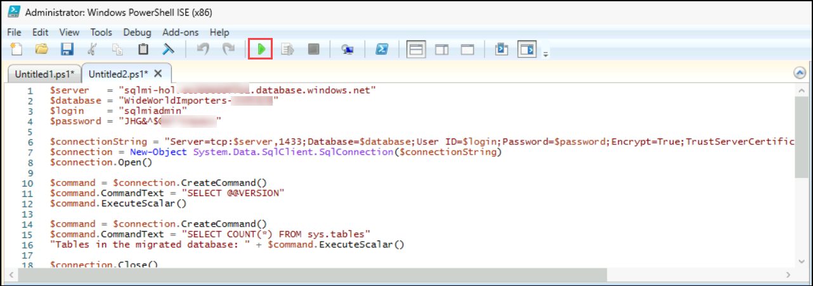

1. Review the output. The version string begins with **Microsoft SQL Azure**, followed by the number of tables in the migrated database.

   > **Note:** The version string confirms you are connected to Azure SQL Managed Instance and not to the original on-premises SQL Server, which would report **Microsoft SQL Server 2019**. The table count confirms that the migration you completed in Exercise 1 brought the schema across intact.

   > **Note:** In a real migration, this connection string is the value that replaces the on-premises connection string in the application's configuration file.

   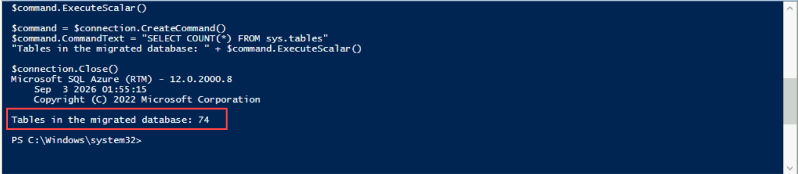

1. Next, check how the migrated database is configured. In the **Windows PowerShell ISE** script pane **(1)**, paste the following script, and then click on the green **Run Script (3)** button or press the **F5** key:

   ```powershell
   $connection = New-Object System.Data.SqlClient.SqlConnection($connectionString)
   $connection.Open()

   $command = $connection.CreateCommand()
   $command.CommandText = "SELECT d.name AS DatabaseName, d.state_desc AS State, d.recovery_model_desc AS RecoveryModel, d.compatibility_level AS CompatibilityLevel, CASE WHEN dek.encryption_state = 3 THEN 'Encrypted' ELSE 'Not encrypted' END AS Encryption FROM sys.databases d LEFT JOIN sys.dm_database_encryption_keys dek ON d.database_id = dek.database_id WHERE d.name = '$database'"

   $reader = $command.ExecuteReader()
   while ($reader.Read()) {
       "Database:            " + $reader["DatabaseName"]
       "State:               " + $reader["State"]
       "Recovery model:      " + $reader["RecoveryModel"]
       "Compatibility level: " + $reader["CompatibilityLevel"]
       "Encryption:          " + $reader["Encryption"]
   }
   $reader.Close()
   $connection.Close()
   ```

   > **Note:** This script reports the properties a database administrator checks after every migration. Rather than trusting the portal status alone, it asks the Managed Instance directly what state the database is actually in.

   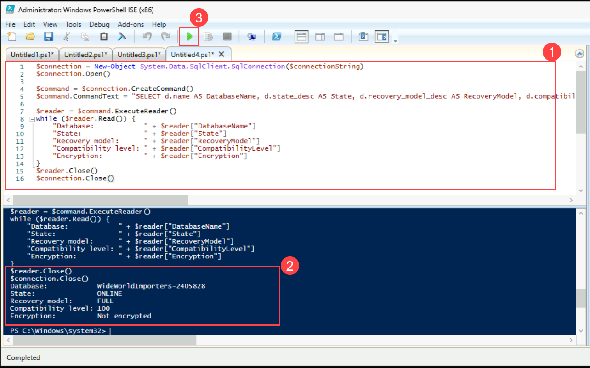

1. Review the five values returned in the console pane **(2)**:

   | Property | Value you should see | What it tells you |
   | --- | --- | --- |
   | **Database** | WideWorldImporters-<inject key="DeploymentID" enableCopy="false"/> | The database you migrated in Exercise 1. |
   | **State** | ONLINE | The database is available for the application to use. |
   | **Recovery model** | FULL | Required for the online migration you ran. Transaction log backups can only be taken from a database in FULL recovery, and those log backups are what kept the target in sync until you completed the cutover. |
   | **Compatibility level** | 100 | Carried across from the source database unchanged. Level 100 corresponds to SQL Server 2008. |
   | **Encryption** | Not encrypted | The source database was not encrypted, and the migration preserved that setting. |

   > **Note:** The compatibility level is the clearest evidence of why Azure SQL Managed Instance was chosen for this migration. The database still runs at the SQL Server 2008 compatibility level on a platform service released more than a decade later, so queries written against the original database behave exactly as they did before and the application needs no code changes.

   > **Note:** Transparent Data Encryption is enabled by default on **new** databases created on a Managed Instance, but a database restored from an unencrypted backup keeps the source setting. Enabling it is a post-migration step rather than something the migration does for you.

   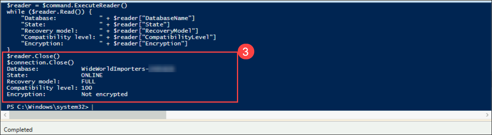

1. Finally, look at what is actually inside the migrated database. In the **Windows PowerShell ISE** script pane **(1)**, paste the following script, and then click on the green **Run Script (3)** button or press the **F5** key:

   ```powershell
   $connection = New-Object System.Data.SqlClient.SqlConnection($connectionString)
   $connection.Open()

   $command = $connection.CreateCommand()
   $command.CommandText = "SELECT TOP 10 s.name AS SchemaName, t.name AS TableName, SUM(p.rows) AS TotalRows FROM sys.tables t JOIN sys.schemas s ON t.schema_id = s.schema_id JOIN sys.partitions p ON t.object_id = p.object_id WHERE p.index_id IN (0,1) GROUP BY s.name, t.name ORDER BY SUM(p.rows) DESC"

   $reader = $command.ExecuteReader()
   while ($reader.Read()) {
       "{0}.{1}  -  {2} rows" -f $reader["SchemaName"], $reader["TableName"], $reader["TotalRows"]
   }
   $reader.Close()
   $connection.Close()
   ```

   > **Note:** The previous step returned a table count. This one lists the ten largest tables by row count, so you can see the actual data that came across from the on-premises server.

   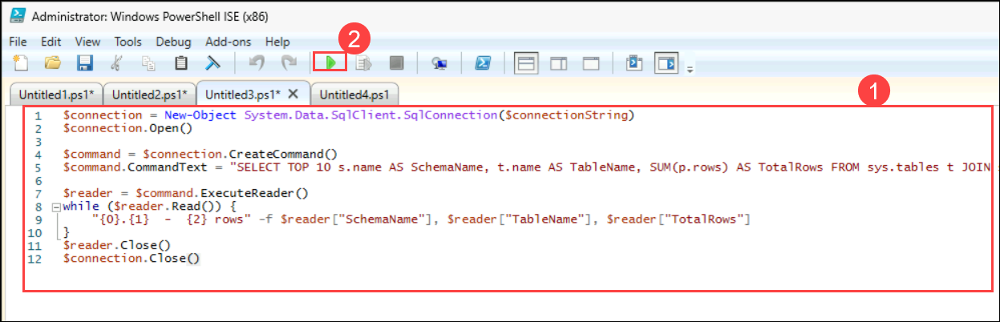

1. Review the output in the console pane. Each line is formatted as `Schema.TableName  -  N rows`. The largest table is **Sales.SalesOrderDetail** with over 121,000 rows, followed by **Production.TransactionHistory** and **Production.TransactionHistoryArchive**.

   | Schema | What it holds |
   | --- | --- |
   | **Sales** | Order headers, order lines, and the reasons recorded against each sale. |
   | **Production** | Manufacturing data, including work orders, routing, and transaction history. |
   | **Person** | Customer and employee records, including contact details and credentials. |

   > **Note:** This is the data that was sitting on the on-premises SQL Server when you started this lab. It now runs on a fully managed platform service, and the query you just ran is ordinary T-SQL that would have worked unchanged against the original server.

   > **Note:** The largest tables are the ones that determine how long a migration takes and how much a mistake costs. In a real project, these are the tables whose row counts you compare between source and target before signing off the cutover.

   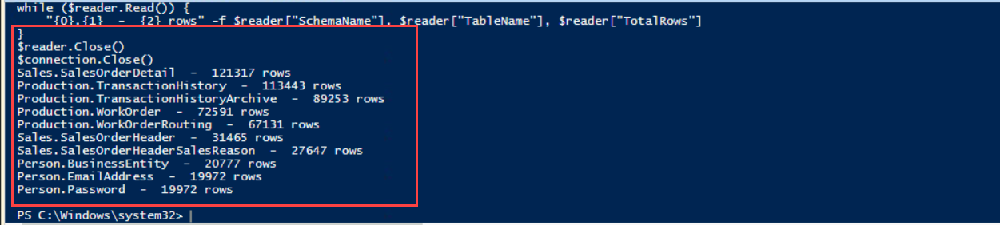

## 🧾 Summary

In this exercise, you accomplished the following:

- Created a Windows Server 2025 Datacenter: Azure Edition virtual machine to host the migrated web application.
- Placed the virtual machine in the lab virtual network with no public IP address.
- Verified secure remote desktop access to the virtual machine using Azure Bastion.
- Confirmed private connectivity from the application server to the Azure SQL Managed Instance on port 1433.
- Inspected the migrated database, including its configuration and its largest tables.

### You have successfully completed this exercise. Click on **Next >>** to proceed with the next exercise.

