# Exercise 3: Azure Arc-enable on-premises VM

### Estimated Duration: 45 Minutes

## 📘 Lab Scenario

In this exercise, you Azure Arc-enable a Windows Server virtual machine that Tailspin Toys runs on-premises. There are no plans to migrate this server to Azure, but Tailspin Toys wants to manage all of its servers — both in Azure and on-premises — from a single place. **Azure Arc** makes this possible by projecting the on-premises server into Azure so that it can be governed and managed alongside native Azure resources.

## 📋 Overview

This exercise extends Azure management to a server that stays on-premises. You generate an Azure Arc onboarding script from the Azure portal, run it on a simulated on-premises virtual machine that runs inside a Hyper-V host, and then verify that the machine appears in Azure as a **Connected** Azure Arc-enabled server.

> **Note:** Not every server can or should be migrated. Some workloads are tied to specific hardware, and others cannot move because of latency, compliance, or licensing constraints. Azure Arc addresses this by bringing Azure management to those servers rather than moving the servers to Azure. Once a machine is Arc-enabled, it receives its own Azure Resource ID and appears in the portal, in Azure Policy, and in Azure Monitor next to your native Azure resources.

## 🎯 Objectives

In this exercise, you will complete the following tasks:

- **Task 1:** Generate the Azure Arc onboarding script
- **Task 2:** Run the script on the on-premises virtual machine
- **Task 3:** Verify the Azure Arc-enabled server

---

## Task 1: Generate the Azure Arc onboarding script

In this task, you use the Azure portal to generate the onboarding script that installs and configures the Azure Connected Machine agent.

1. Sign in to the **Azure portal** at `https://portal.azure.com`.

1. In the top **Search** bar, type **Azure Arc (1)**, and then select **Azure Arc (2)**.

   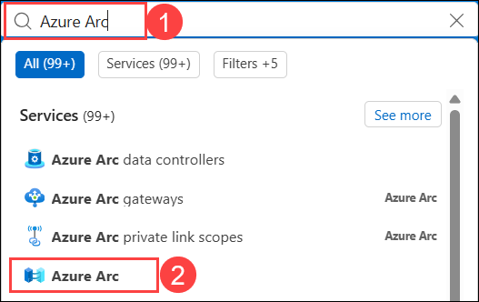

1. In the Azure Arc menu on the left, expand **Infrastructure (1)**, and then select **Machines (2)**.

   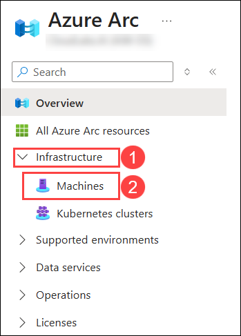

1. On the **Machines** page, select **Onboard/Create (1)** in the upper-left corner, and then select **Onboard existing machines (2)** from the drop-down list.

   > **Note:** The **Onboard existing machines** option generates a script for servers you already run. The other options in this menu are for scenarios such as onboarding at scale with a service principal, which is how an organization would typically Arc-enable hundreds of servers at once.

   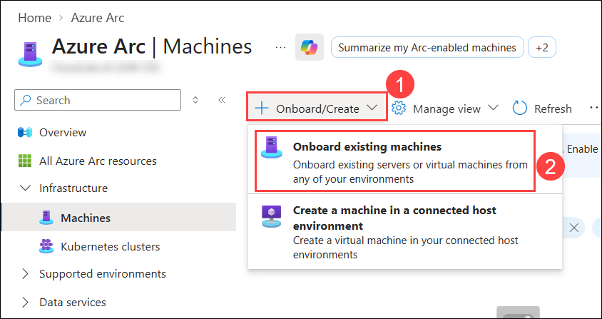

1. On the **Onboard existing machines with Azure Arc** page, under **Project details**, enter the following values:

   - **Subscription (1)**: The lab subscription
   - **Resource group (2)**: **tailspin-<inject key="DeploymentID" enableCopy="false"/>**
   - **Region (3)**: **Central US**
   - **Operating system (4)**: **Windows**

   > **Note:** The region you select here determines where the Arc machine's metadata is stored in Azure. It does not need to match the physical location of the server, but organizations usually choose the Azure region closest to their datacentre.

   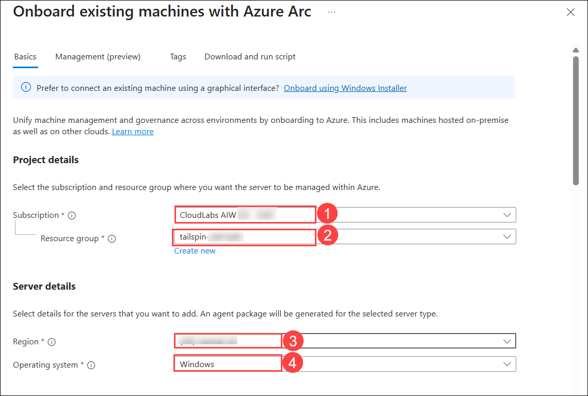

1. Under **Connectivity method**, select **Public endpoint (1)**. Under **Authentication**, select **Authenticate machine manually (2)**, and then click on **Download and run script (3)**.

   > **Note:** **Public endpoint** means the server connects to Azure over the internet on port 443 outbound. Production environments often use a private endpoint or an Azure Arc gateway instead, so that traffic never leaves the private network. **Authenticate machine manually** prompts for an interactive sign-in, which suits a single server; onboarding many servers at once uses a service principal instead.

   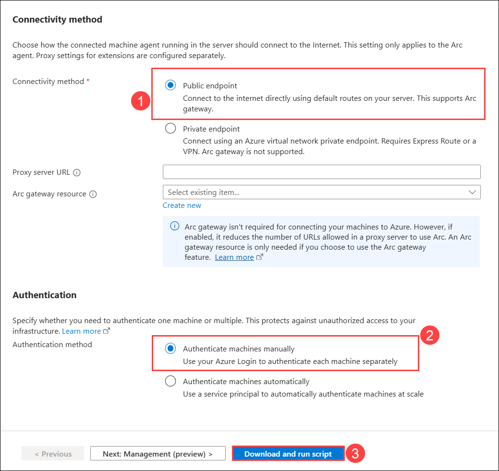

1. On the **Download and run script** tab, select **Download** to save the **OnboardingScript.ps1** file.

   > **Note:** Keep this browser tab open. You will copy the script contents into the on-premises virtual machine in the next task.

   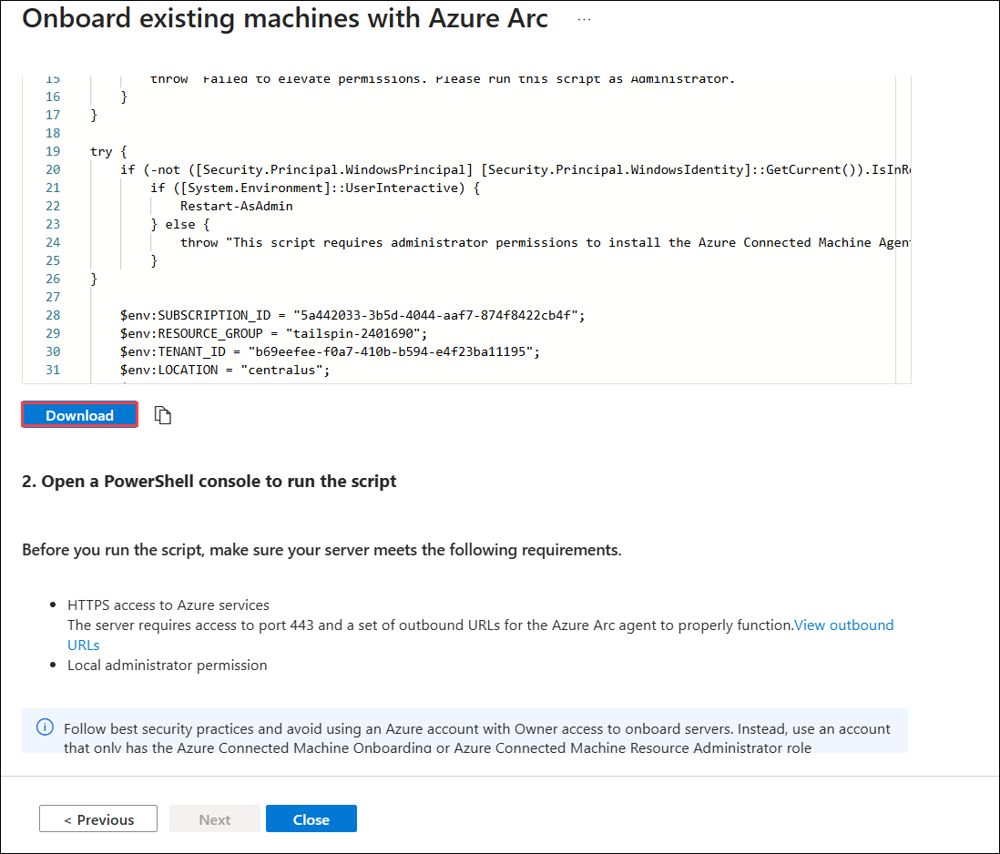

---

## Task 2: Run the script on the on-premises virtual machine

In this task, you connect to the simulated on-premises server and run the onboarding script on it. The script installs the Azure Connected Machine agent and registers the server with Azure.

1. In the Azure portal, open the resource group **tailspin-<inject key="DeploymentID" enableCopy="false"/>**.

   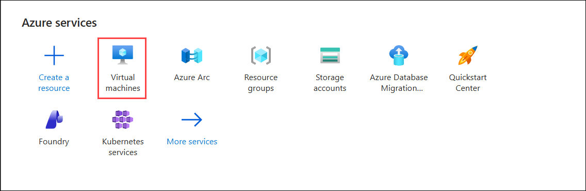

1. Select the virtual machine named **tailspin-onprem-<inject key="DeploymentID" enableCopy="false"/>-hyperv-vm**.

   > **Note:** This is the Hyper-V host virtual machine. The on-premises server that you will Arc-enable runs as a nested virtual machine named **OnPremVM** inside this host. Nested virtualization lets this lab simulate a physical on-premises server without any hardware.

   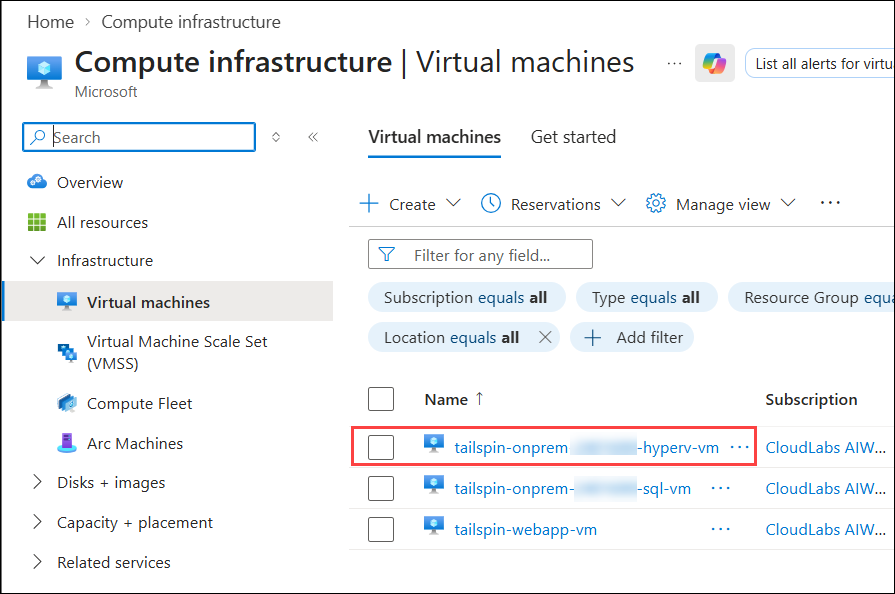

1. On the left menu, under **Connect (1)**, select **Bastion (2)**.

   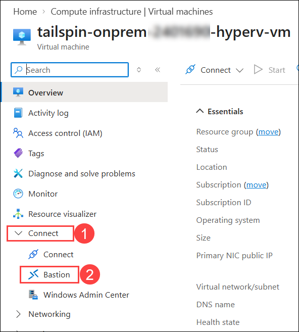

1. Enter the following credentials, and then select **Connect (3)**:

   - **Username (1)**: labuser
   - **VM Password (2)**: labuser!pass123

   > **Note:** The virtual machine opens in a new browser tab. Azure Bastion provides this session over HTTPS, so the Hyper-V host never needs an open RDP port on the internet.

   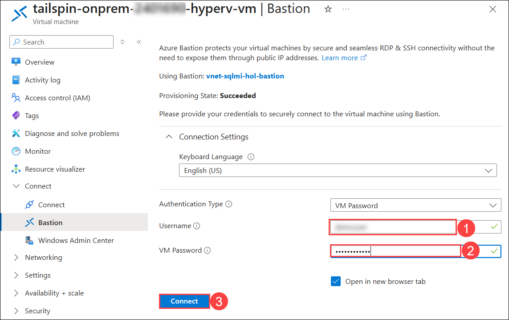

1. On the Hyper-V host, double-click on **Hyper-V Manager** to open it.

   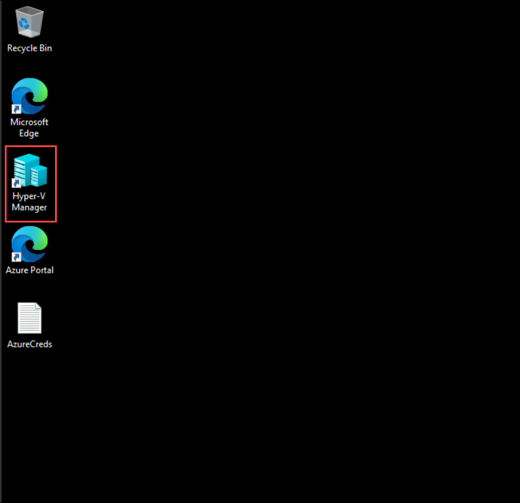

1. In **Hyper-V Manager**, select **OnPremVM (1)**, and then click on **Start (2)**. The virtual machine is in the **Off** state when you first connect.

   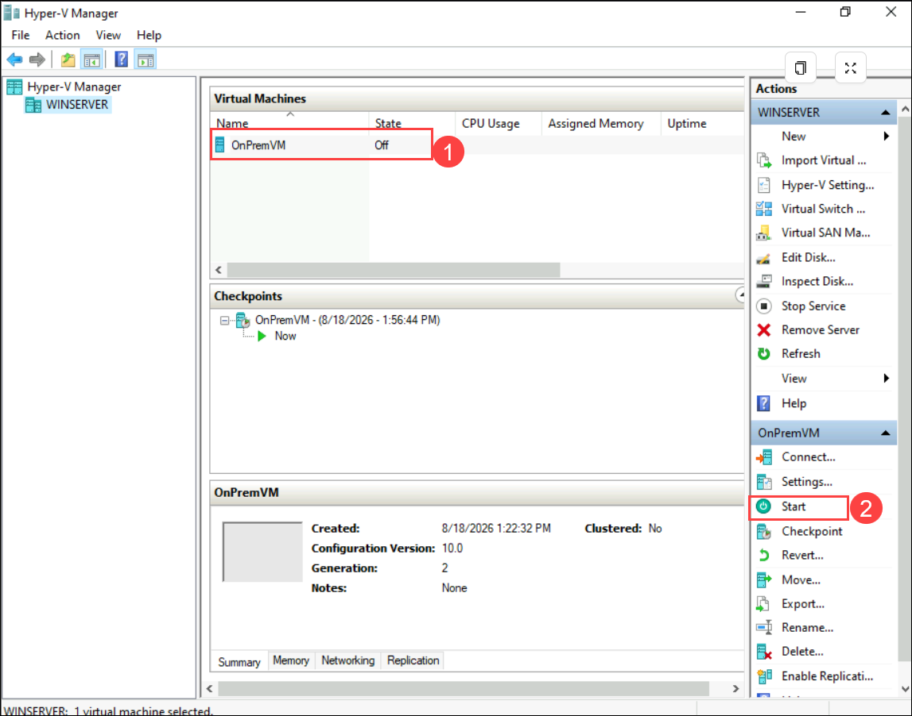

1. Wait until the state changes to **Running**, and then double-click on the **OnPremVM** virtual machine to open a connection to it.

   > **Note:** The virtual machine takes one to two minutes to boot. If the connection window is black, wait a few seconds and then click inside it.

   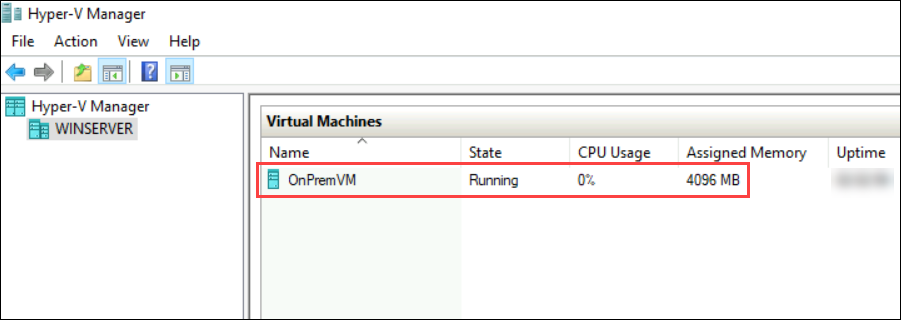

1. On the **OnPremVM** sign-in page, enter the following password **(1)**, and then click on the **arrow (2)** button or press the **Enter** key to sign in.

   - **Username**: Administrator
   - **Password (1)**: labuser!pass123

   > **Note:** If the sign-in screen shows **Press Ctrl+Alt+Delete to unlock**, use the **Action > Ctrl+Alt+Delete** menu in the connection window. The keyboard shortcut is captured by your local machine rather than the nested virtual machine.

   > **Note:** If **OnPremVM** shows **No Internet Connection**, return to the **tailspin-onprem-<inject key="DeploymentID" enableCopy="false"/>-hyperv-vm** host, open **Network Connections**, right-click on the **Ethernet** connection, select **Properties > Sharing**, and then disable and re-enable **Internet Connection Sharing**. This restores internet access for the nested OnPremVM. The Azure Connected Machine agent needs outbound internet access to reach Azure, so the script fails without it.

   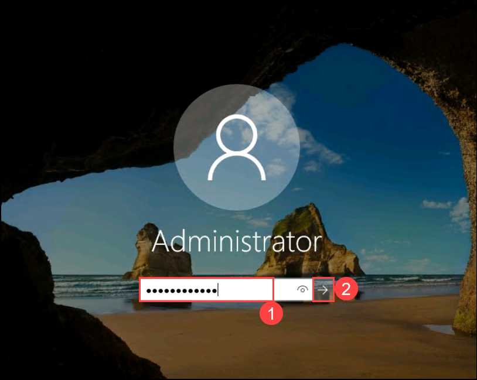

1. On **OnPremVM**, search for **Windows PowerShell ISE (1)**, right-click on **Windows PowerShell ISE (2)**, and then select **Run as administrator (3)**.

   > **Important:** Run the onboarding script inside **OnPremVM**, not on the Hyper-V host. The Hyper-V host is itself an Azure virtual machine, and the Azure Connected Machine agent refuses to install on Azure virtual machines with the message *"Cannot install Azure Connected Machine agent on an Azure Virtual Machine."* Azure virtual machines are already managed by Azure and do not need Azure Arc.

   > **Note:** Administrator rights are required because the script installs a Windows service and writes to **C:\Program Files\AzureConnectedMachineAgent**.

   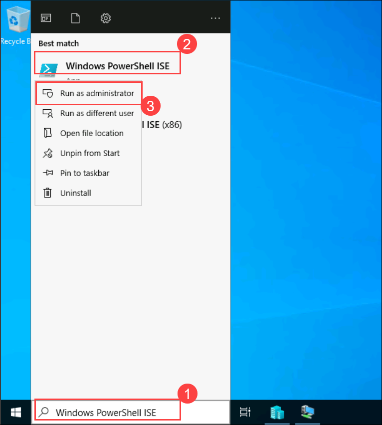

1. Switch to the Azure portal browser tab from Task 1 and copy the full contents of the generated **OnboardingScript.ps1** file. Paste the contents into the PowerShell ISE script window on **OnPremVM**.

   > **Note:** If a normal paste does not work, use the **Clipboard > Type clipboard text** menu in the Hyper-V connection window. Clipboard sharing is unavailable in a basic Hyper-V session.

   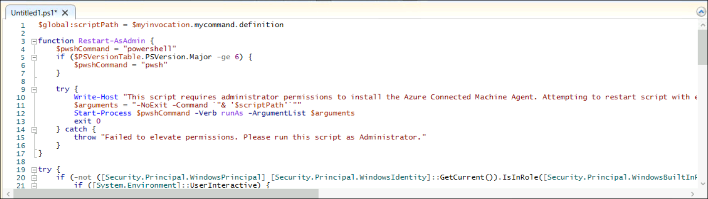

1. Run the script by pressing the **F5** key or by selecting the green **Run (1)** button. The script downloads and installs the Azure Connected Machine agent, and then opens a browser window for authentication.

   > **Note:** The script opens a browser window and asks you to sign in to Azure. Enter the following credentials when prompted:
   - **Username:** <inject key="AzureAdUserEmail"></inject>
   - **Password:** <inject key="AzureAdUserPassword"></inject>

   > **Note:** The script takes three to five minutes to complete. Most of that time is spent downloading the agent package. Leave the window open until it finishes.

   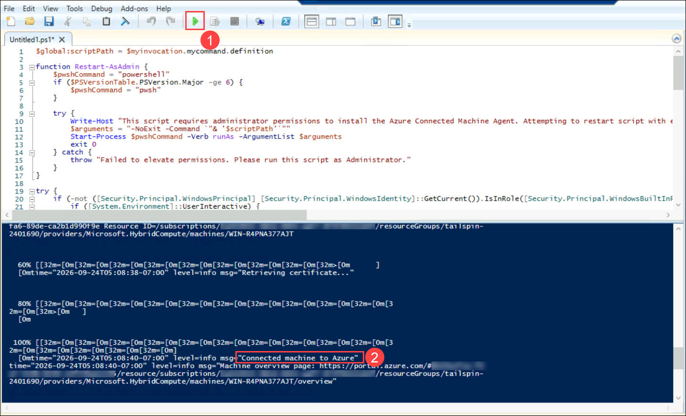

1. When the script finishes successfully, it displays a **Connected machine to Azure (2)** message along with the Azure resource URL for the newly Arc-enabled server.

   

---

## Task 3: Verify the Azure Arc-enabled server

In this task, you confirm that the on-premises server now appears in Azure and can be managed from the portal.

1. In the Azure portal, open the resource group **tailspin-<inject key="DeploymentID" enableCopy="false"/>**, locate the resource of type **Machine - Azure Arc**, and then select it.

   > **Note:** The resource takes up to five minutes to appear. If you do not see it, select **Refresh** on the resource group page.

   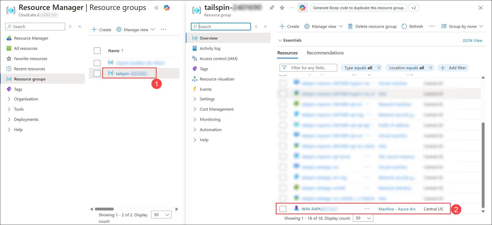

1. On the **Machine - Azure Arc** overview page, confirm that the **Status** shows **Connected**. The **Computer name** and **Operating system** are also displayed, confirming that Azure can now see details about the on-premises server.

   > **Note:** The status is based on a heartbeat that the agent sends to Azure every five minutes. A machine that has not sent a heartbeat for longer than that shows as **Disconnected**, which is how you would spot an offline server in a real environment.

   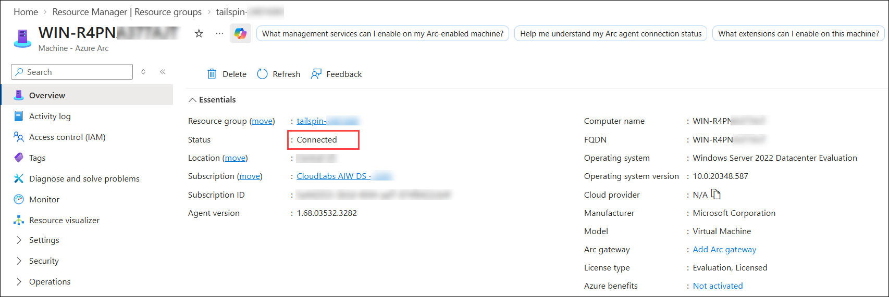

1. Explore the left menu. Options such as **Extensions**, **Policies**, and **Inventory** show that the on-premises server can now be managed in the same way as a native Azure virtual machine.

   > **Note:** These options are what make Arc valuable in practice. **Extensions** installs agents such as Azure Monitor or Microsoft Defender for Cloud. **Policies** applies the same Azure Policy definitions you use for Azure virtual machines. **Azure Update Manager** patches the server on the same schedule as the rest of the estate. None of this requires the server to move to Azure.

   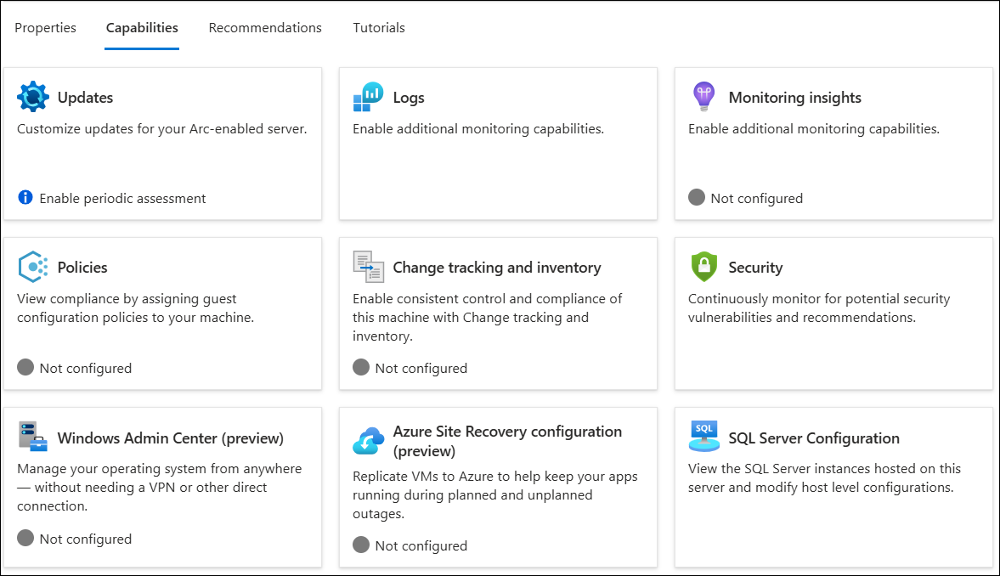

---

## 🧾 Summary

In this exercise, you accomplished the following:

- Generated an Azure Arc onboarding script from the Azure portal.
- Prepared the simulated on-premises virtual machine and ran the onboarding script to install the Azure Connected Machine agent.
- Verified that the Azure Arc-enabled server shows a **Connected** status in the Azure portal.

You have now completed the full migration story for Tailspin Toys. The database tier runs on Azure SQL Managed Instance, the application tier runs on a Windows Server virtual machine in Azure, and the server that stays on-premises is managed from Azure through Azure Arc.

---

## Troubleshooting

**The script reports "Cannot install Azure Connected Machine agent on an Azure Virtual Machine."**
The script is running on the Hyper-V host instead of the nested virtual machine. Open **Hyper-V Manager**, connect to **OnPremVM**, and run the script inside that session.

**The script fails to download the agent, or reports a network error.**
OnPremVM has no internet access. Follow the Internet Connection Sharing note in step 8, then run the script again.

**The authentication window returns error AZCM0042.**
You signed in with a personal Microsoft account. Sign in with the organization account provided for this lab instead.

**The Arc machine does not appear in the resource group.**
Wait five minutes and select **Refresh**. Also confirm that you selected the correct resource group in Task 1, step 5.

### You have successfully completed the lab!

