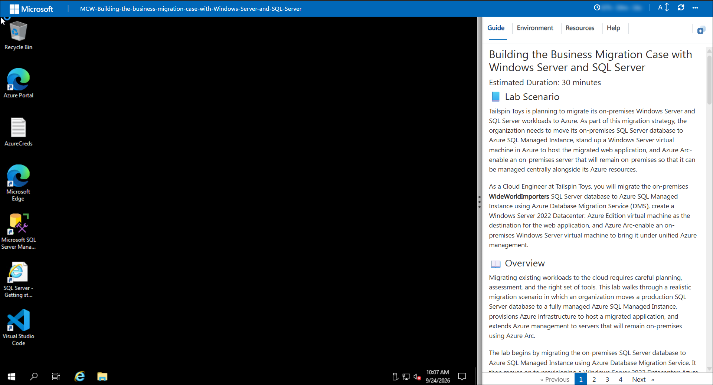
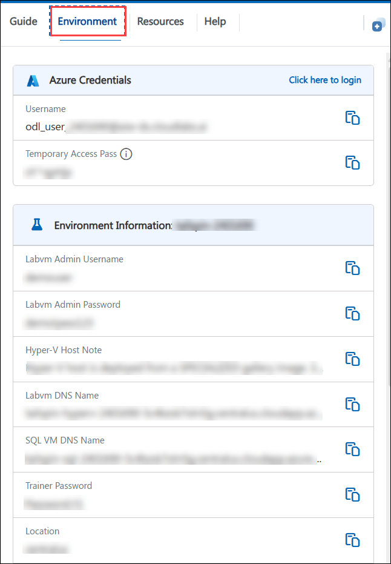
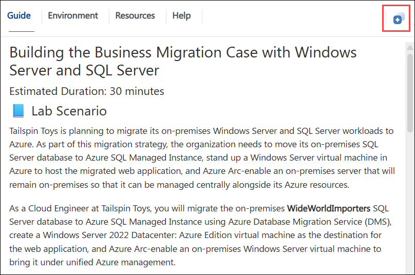
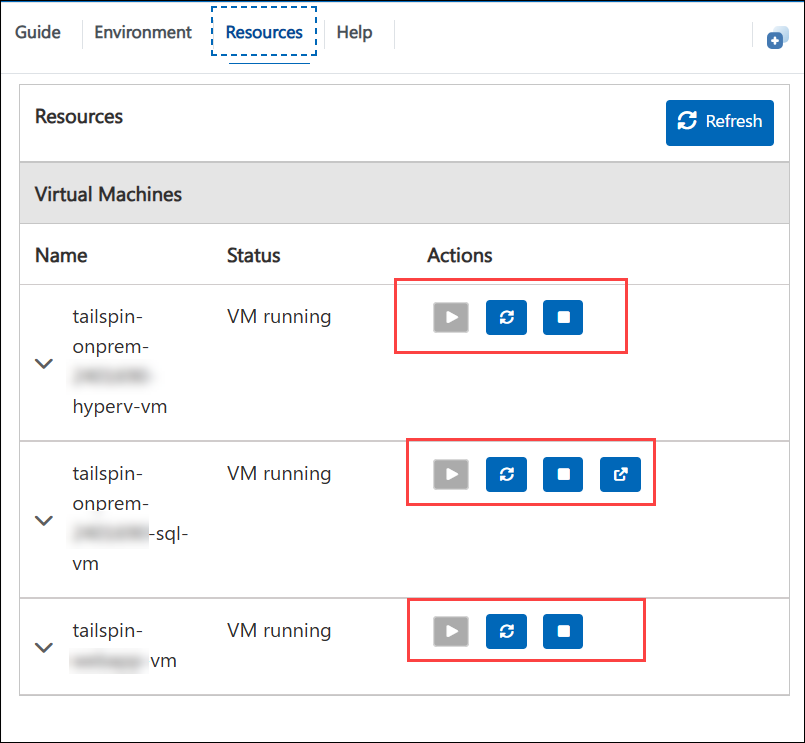
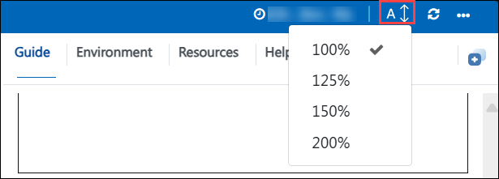
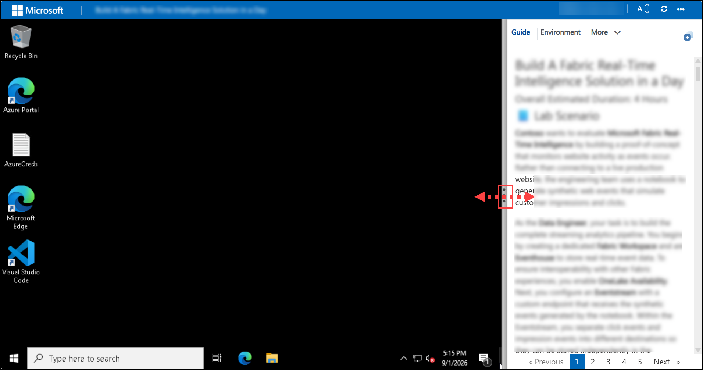
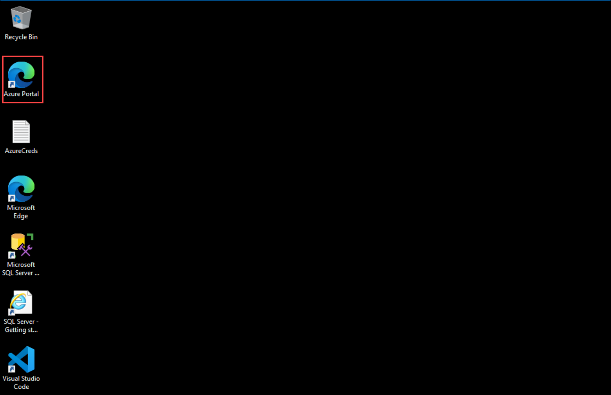
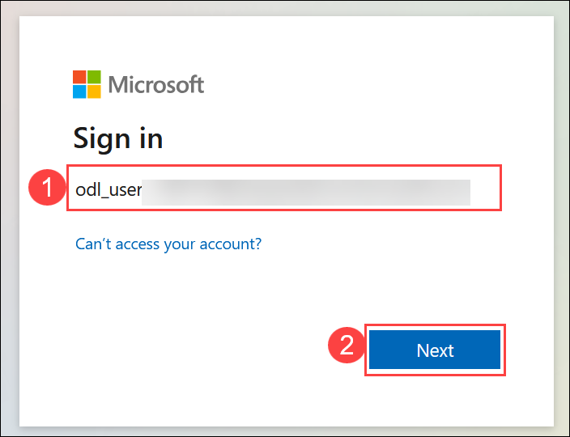
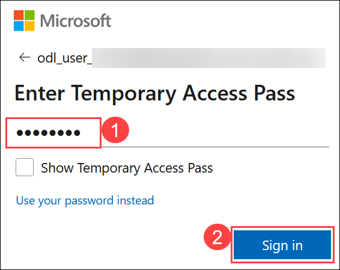
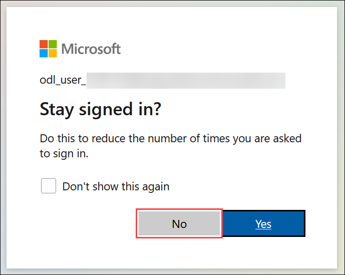

# Building the Business Migration Case with Windows Server and SQL Server

### Estimated Duration: 8 Hours

## 📘 Lab Scenario

Tailspin Toys is planning to migrate its on-premises Windows Server and SQL Server workloads to Azure. As part of this migration strategy, the organization needs to move its on-premises SQL Server database to Azure SQL Managed Instance, stand up a Windows Server virtual machine in Azure to host the migrated web application, and Azure Arc-enable an on-premises server that will remain on-premises so that it can be managed centrally alongside its Azure resources.

As a Cloud Engineer at Tailspin Toys, you will migrate the on-premises **WideWorldImporters** SQL Server database to Azure SQL Managed Instance using Azure Database Migration Service (DMS), create a Windows Server 2022 Datacenter: Azure Edition virtual machine as the destination for the web application, and Azure Arc-enable an on-premises Windows Server virtual machine to bring it under unified Azure management.

## 📖 Overview

Migrating existing workloads to the cloud requires careful planning, assessment, and the right set of tools. This lab walks through a realistic migration scenario in which an organization moves a production SQL Server database to a fully managed Azure SQL Managed Instance, provisions Azure infrastructure to host a migrated application, and extends Azure management to servers that will remain on-premises using Azure Arc.

The lab begins by migrating the on-premises SQL Server database to Azure SQL Managed Instance using Azure Database Migration Service. It then moves on to provisioning a Windows Server 2022 Datacenter: Azure Edition virtual machine that will serve as the destination for the migrated web application. Finally, it demonstrates how to Azure Arc-enable an on-premises virtual machine so that it can be governed, monitored, and managed from within Azure alongside native Azure resources.

## 🎯 Objectives

By the end of this lab, you will be able to:

- **Exercise 1 - SQL database migration:** Back up the on-premises WideWorldImporters database and migrate it to a pre-provisioned Azure SQL Managed Instance using Azure Database Migration Service (DMS) from the Azure portal.

- **Exercise 2 - Create a VM to migrate the web application:** Create a Windows Server 2022 Datacenter: Azure Edition virtual machine to serve as the destination host for the migrated web application, and validate secure remote access using Azure Bastion.

- **Exercise 3 - Azure Arc-enable an on-premises VM:** Generate and run the Azure Arc onboarding script to connect an on-premises Windows Server virtual machine to Azure, enabling unified management through Azure Arc.

## ⚙️ Prerequisites

Participants should have:

- Basic understanding of Azure services such as Azure SQL Managed Instance and Azure Virtual Machines.
- Basic familiarity with SQL Server database concepts and migration.
- Basic familiarity with the Azure portal.

## 🏗️ Architecture

This architecture represents a hybrid migration workflow. A simulated on-premises environment, consisting of a Hyper-V host virtual machine and a SQL Server virtual machine, runs the source WideWorldImporters database. The database is migrated to a pre-provisioned Azure SQL Managed Instance that resides in a delegated subnet within an Azure virtual network. A Windows Server 2022 Datacenter: Azure Edition virtual machine is provisioned within the same virtual network to host the migrated web application, with secure administrative access provided through Azure Bastion. A virtual machine running inside the Hyper-V host is Azure Arc-enabled so that it can be managed centrally from Azure without being migrated.

## 🖼️ Architecture Diagram

## 🔍 Explanation of Components

- **Simulated on-premises Hyper-V host VM:** A Windows Server virtual machine in Azure that hosts a nested virtual machine (OnPremVM), simulating the customer's on-premises environment for the Azure Arc scenario.

- **Simulated on-premises SQL Server VM:** A Windows Server virtual machine running SQL Server that holds the source WideWorldImporters database to be migrated.

- **Azure SQL Managed Instance:** The fully managed platform as a service (PaaS) target for the database migration, pre-provisioned in a delegated subnet within the lab virtual network.

- **Azure Database Migration Service (DMS):** The Azure service used to orchestrate the online migration of the database to Azure SQL Managed Instance from the Azure portal.

- **SQL Server Management Studio (SSMS):** Used on the source SQL Server VM to create the database backup.

- **Windows Server 2022 Datacenter: Azure Edition VM:** The destination virtual machine that will host the migrated web application, benefiting from Azure Edition capabilities such as Hotpatching, which installs security updates without requiring a restart.

- **Azure Bastion:** Provides secure RDP connectivity to Azure virtual machines directly from the Azure portal, without exposing public RDP endpoints.

- **Azure Arc:** Extends Azure management, governance, and monitoring to machines hosted outside of Azure through the Azure Connected Machine agent. Once connected, each machine is treated as a resource in Azure with its own Azure Resource ID.

- **Azure Virtual Network:** Hosts the lab resources, including a dedicated delegated subnet for the Azure SQL Managed Instance and a management subnet for the virtual machines.

## 🚀 Getting Started with the Lab

Welcome to your Building the Business Migration Case with Windows Server and SQL Server workshop. Let's begin by making the most of this experience.

### Accessing Your Lab Environment

Once you're ready to dive in, your virtual machine and **Guide** will be right at your fingertips within your web browser.

> **Note:** If you see a PowerShell window running, minimize it after accessing the environment to ensure the script continues to run in the background without interruption.

### Virtual Machine and Lab Guide

Your virtual machine is your workhorse throughout the workshop, and the lab guide is your roadmap to success.

### Exploring Your Lab Resources

To get a better understanding of your lab resources and credentials, navigate to the **Environment** tab.

### Utilizing the Split Window Feature

For convenience, you can open the lab guide in a separate window by selecting the **Split Window** button from the top-right corner.

### Managing Your Virtual Machine

From the **Resources** tab, you can **Start, Stop, or Restart** your virtual machine as needed. Your experience is in your hands.

### Lab Guide Zoom In and Zoom Out

To adjust the zoom level for the environment page, click on the **A↕** icon located next to the timer in the lab environment.

### Resize the Virtual Machine View

Use the **slider (three vertical dots)** located between the Virtual Machine and the Lab Guide panes to adjust the display size, allowing you to customize the layout based on your preference.

   

### Let's Get Started with the Azure Portal

1. On your virtual machine, click on the Azure portal icon.

   

1. On the **Sign in to Microsoft Azure** tab, enter the following **Email/Username (1)**, and then click on **Next (2)**.

   - **Email/Username:** <inject key="AzureAdUserEmail"></inject>

   

1. Enter the following **Temporary password (1)**, and then click on **Sign in (2)**.

   - **Temp Access Pass:** <inject key="AzureAdUserPassword"></inject>

   

1. If you are prompted to stay signed in, click on **No**.

   

## 📞 Support Contact

The CloudLabs support team is available 24/7, 365 days a year, via email and live chat to ensure seamless assistance at any time. We offer dedicated support channels tailored specifically for both learners and instructors, ensuring that all your needs are promptly and efficiently addressed.

Learner Support Contacts:

- Email Support: [cloudlabs-support@spektrasystems.com](mailto:cloudlabs-support@spektrasystems.com)
- Live Chat Support: https://cloudlabs.ai/labs-support

Click on **Next >>** from the bottom-right corner to embark on your lab journey.

Now you're all set to explore the powerful world of technology. Feel free to reach out if you have any questions along the way. Enjoy your workshop!

## Happy Learning!!