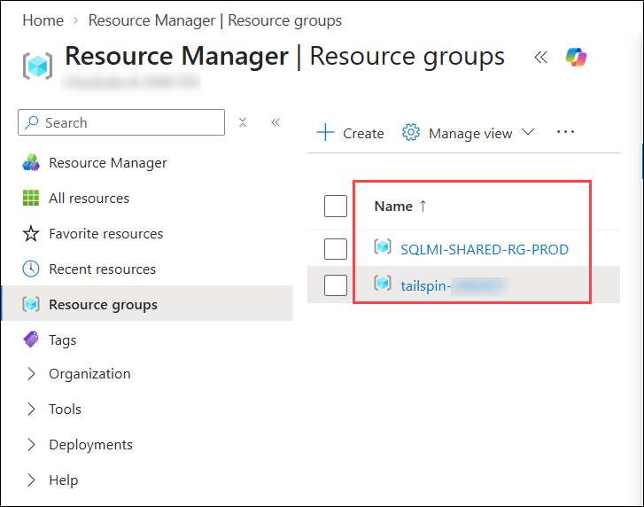
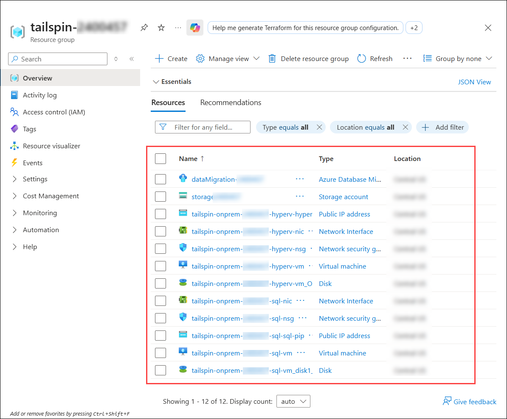
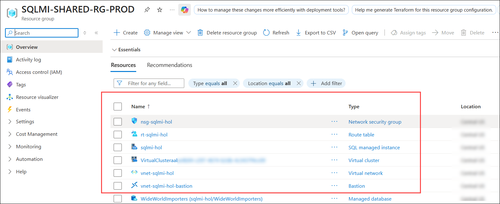

# Building the Business Migration Case with Windows Server and SQL Server

### Estimated Duration: 8 Hours

## 📘 Lab Scenario

Tailspin Toys is planning to migrate its on-premises Windows Server and SQL Server workloads to Azure. As part of this migration strategy, the organization needs to move its on-premises SQL Server database to Azure SQL Managed Instance, stand up a Windows Server virtual machine in Azure to host the migrated web application, and Azure Arc-enable an on-premises server that will remain on-premises so that it can be managed centrally alongside its Azure resources.

As a Cloud Engineer at Tailspin Toys, you will migrate the on-premises **WideWorldImporters** SQL Server database to Azure SQL Managed Instance using Azure Database Migration Service (DMS), create a Windows Server 2022 Datacenter: Azure Edition virtual machine as the destination for the web application, and Azure Arc-enable an on-premises Windows Server virtual machine to bring it under unified Azure management.

## 📖 Overview

Migrating existing workloads to the cloud requires careful planning, assessment, and the right set of tools. This lab walks through a realistic migration scenario in which an organization moves a production SQL Server database to a fully managed Azure SQL Managed Instance, provisions Azure infrastructure to host a migrated application, and extends Azure management to servers that will remain on-premises using Azure Arc.

The lab begins by migrating the on-premises SQL Server database to Azure SQL Managed Instance using Azure Database Migration Service. It then moves on to provisioning a Windows Server 2022 Datacenter: Azure Edition virtual machine that will serve as the destination for the migrated web application. Finally, it demonstrates how to Azure Arc-enable an on-premises virtual machine so that it can be governed, monitored, and managed from within Azure alongside native Azure resources.

## 🎯 Objectives

By the end of this lab, you will be able to:

- **Exercise 1 - SQL database migration:** Back up the on-premises WideWorldImporters database and migrate it to a pre-provisioned Azure SQL Managed Instance using Azure Database Migration Service (DMS) from the Azure portal.

- **Exercise 2 - Create a VM to migrate the web application:** Create a Windows Server 2022 Datacenter: Azure Edition virtual machine to serve as the destination host for the migrated web application, and validate secure remote access using Azure Bastion.

- **Exercise 3 - Azure Arc-enable an on-premises VM:** Generate and run the Azure Arc onboarding script to connect an on-premises Windows Server virtual machine to Azure, enabling unified management through Azure Arc.

## ⚙️ Prerequisites

Participants should have:

- Basic understanding of Azure services such as Azure SQL Managed Instance and Azure Virtual Machines.
- Basic familiarity with SQL Server database concepts and migration.
- Basic familiarity with the Azure portal.

## 🏗️ Architecture

This architecture represents a hybrid migration workflow. A simulated on-premises environment, consisting of a Hyper-V host virtual machine and a SQL Server virtual machine, runs the source WideWorldImporters database. The database is migrated to a pre-provisioned Azure SQL Managed Instance that resides in a delegated subnet within an Azure virtual network. A Windows Server 2022 Datacenter: Azure Edition virtual machine is provisioned within the same virtual network to host the migrated web application, with secure administrative access provided through Azure Bastion. A virtual machine running inside the Hyper-V host is Azure Arc-enabled so that it can be managed centrally from Azure without being migrated.

## 🖼️ Architecture Diagram

## 🔍 Explanation of Components

- **Simulated on-premises Hyper-V host VM:** A Windows Server virtual machine in Azure that hosts a nested virtual machine (OnPremVM), simulating the customer's on-premises environment for the Azure Arc scenario.

- **Simulated on-premises SQL Server VM:** A Windows Server virtual machine running SQL Server that holds the source WideWorldImporters database to be migrated.

- **Azure SQL Managed Instance:** The fully managed platform as a service (PaaS) target for the database migration, pre-provisioned in a delegated subnet within the lab virtual network.

- **Azure Database Migration Service (DMS):** The Azure service used to orchestrate the online migration of the database to Azure SQL Managed Instance from the Azure portal.

- **SQL Server Management Studio (SSMS):** Used on the source SQL Server VM to create the database backup.

- **Windows Server 2022 Datacenter: Azure Edition VM:** The destination virtual machine that will host the migrated web application, benefiting from Azure Edition capabilities such as Hotpatching, which installs security updates without requiring a restart.

- **Azure Bastion:** Provides secure RDP connectivity to Azure virtual machines directly from the Azure portal, without exposing public RDP endpoints.

- **Azure Arc:** Extends Azure management, governance, and monitoring to machines hosted outside of Azure through the Azure Connected Machine agent. Once connected, each machine is treated as a resource in Azure with its own Azure Resource ID.

- **Azure Virtual Network:** Hosts the lab resources, including a dedicated delegated subnet for the Azure SQL Managed Instance and a management subnet for the virtual machines.

## 🚀 Getting Started with the Lab

Welcome to your Building the Business Migration Case with Windows Server and SQL Server workshop. Let's begin by making the most of this experience.

### Accessing Your Lab Environment

Once you're ready to dive in, your virtual machine and **Guide** will be right at your fingertips within your web browser.

> **Note:** If you see a PowerShell window running, minimize it after accessing the environment to ensure the script continues to run in the background without interruption.

### Virtual Machine and Lab Guide

Your virtual machine is your workhorse throughout the workshop, and the lab guide is your roadmap to success.

### Exploring Your Lab Resources

To get a better understanding of your lab resources and credentials, navigate to the **Environment** tab.

### Utilizing the Split Window Feature

For convenience, you can open the lab guide in a separate window by selecting the **Split Window** button from the top-right corner.

### Managing Your Virtual Machine

From the **Resources** tab, you can **Start, Stop, or Restart** your virtual machine as needed. Your experience is in your hands.

### Lab Guide Zoom In and Zoom Out

To adjust the zoom level for the environment page, click on the **A↕** icon located next to the timer in the lab environment.

### Resize the Virtual Machine View

Use the **slider (three vertical dots)** located between the Virtual Machine and the Lab Guide panes to adjust the display size, allowing you to customize the layout based on your preference.

   

### Let's Get Started with the Azure Portal

1. On your virtual machine, click on the Azure portal icon.

   

1. On the **Sign in to Microsoft Azure** tab, enter the following **Email/Username (1)**, and then click on **Next (2)**.

   - **Email/Username:** <inject key="AzureAdUserEmail"></inject>

   

1. Enter the following **Temporary password (1)**, and then click on **Sign in (2)**.

   - **Temp Access Pass:** <inject key="AzureAdUserPassword"></inject>

   

1. If you are prompted to stay signed in, click on **No**.

   

## 🔎 Know Your Resources

Before you begin the exercises, take a few minutes to understand the environment that has been deployed for you. Everything you work with in this lab lives in two resource groups, and knowing what each resource is for will make the exercises easier to follow.

1. In the Azure portal, open **Resource groups**. You will see the two resource groups used by this lab:

   - **tailspin-<inject key="DeploymentID" enableCopy="false"/>**
   - **SQLMI-SHARED-RG-PROD**

      

### Resource group 1: tailspin-<inject key="DeploymentID" enableCopy="false"/>

This is your own resource group. Everything in it was deployed for you and belongs only to your lab environment. It represents the simulated on-premises datacentre for Tailspin Toys, plus the Azure services you use to migrate it.

   

| Resource | Type | Why it is in this lab |
| --- | --- | --- |
| **tailspin-onprem-<inject key="DeploymentID" enableCopy="false"/>-sql-vm** | Virtual machine | The simulated on-premises SQL Server. It holds the **WideWorldImporters** database that you back up and migrate in Exercise 1. This is also the virtual machine you are working on right now. |
| **tailspin-onprem-<inject key="DeploymentID" enableCopy="false"/>-hyperv-vm** | Virtual machine | The simulated on-premises Hyper-V host. A nested virtual machine named **OnPremVM** runs inside it, and that nested machine is the server you Azure Arc-enable in Exercise 3. Nested virtualization lets the lab simulate a physical on-premises server without any hardware. |
| **storage<inject key="DeploymentID" enableCopy="false"/>** | Storage account | Contains the **sql-backup** blob container. In Exercise 1 you upload the database backup here, because Azure Database Migration Service reads the source backup from blob storage rather than from the server. |
| **dataMigration-<inject key="DeploymentID" enableCopy="false"/>** | Azure Database Migration Service | The service that orchestrates the migration in Exercise 1. It reads the backup from blob storage and restores it into the Managed Instance. |
| **tailspin-onprem-<inject key="DeploymentID" enableCopy="false"/>-sql-nic** **tailspin-onprem-<inject key="DeploymentID" enableCopy="false"/>-hyperv-nic** | Network interface | Connects each virtual machine to the shared virtual network. Note that both attach to a virtual network in the *other* resource group, which is what allows the virtual machines to reach the Managed Instance privately. |
| **tailspin-onprem-<inject key="DeploymentID" enableCopy="false"/>-sql-nsg** **tailspin-onprem-<inject key="DeploymentID" enableCopy="false"/>-hyperv-nsg** | Network security group | Controls inbound traffic to each virtual machine. RDP on port 3389 is allowed so you can connect, port 1433 is allowed to the SQL Server virtual machine, and port 2179 is allowed to the Hyper-V host for Virtual Machine Connection. |
| **tailspin-onprem-<inject key="DeploymentID" enableCopy="false"/>-sql-sql-pip** **tailspin-onprem-<inject key="DeploymentID" enableCopy="false"/>-hyperv-hyperv-pip** | Public IP address | Gives each virtual machine a public address and DNS name. These are listed on the **Environment** tab. |
| **tailspin-onprem-<inject key="DeploymentID" enableCopy="false"/>-sql-vm_disk1** **tailspin-onprem-<inject key="DeploymentID" enableCopy="false"/>-hyperv-vm_OsDisk** | Managed disk | The operating system disk for each virtual machine. The Hyper-V host disk is larger because it stores the nested virtual machine's virtual hard disk as well as its own operating system. |

> **Note:** You will also create one more virtual machine in this resource group during Exercise 2, named **tailspin-webapp-vm**. It does not exist yet.

### Resource group 2: SQLMI-SHARED-RG-PROD

This resource group holds the Azure SQL Managed Instance and the network it lives in. It was created before your lab started, because provisioning a Managed Instance can take up to six hours. You have read access to it so that you can select the Managed Instance as the migration target in Exercise 1.

| Resource | Type | Why it is in this lab |
| --- | --- | --- |
| **sqlmi-hol** | SQL managed instance | The destination for the database migration in Exercise 1. This is the fully managed platform as a service version of SQL Server, where Microsoft handles patching, backups, and high availability. |
| **vnet-sqlmi-hol** | Virtual network | The network that contains both the Managed Instance and your lab virtual machines. Because they share a virtual network, traffic between them stays on the Azure backbone and never crosses the public internet. |
| **nsg-sqlmi-hol** | Network security group | Applied to the Managed Instance subnet. Azure requires a network security group on any subnet that hosts a Managed Instance. |
| **rt-sqlmi-hol** | Route table | Also applied to the Managed Instance subnet, and also required by Azure. It directs Managed Instance management traffic correctly. |
| **vnet-sqlmi-hol-bastion** | Bastion | Provides the secure browser-based RDP sessions you use to connect to the virtual machines in Exercises 2 and 3, without any virtual machine needing an open RDP port on the internet. |
| **VirtualCluster...** | Virtual cluster | Created automatically by Azure when the Managed Instance was deployed. It is part of the Managed Instance infrastructure and is not something you interact with. |

### How the network is laid out

The virtual network **vnet-sqlmi-hol** is divided into subnets, and each one has a specific purpose:

| Subnet | Address range | What uses it |
| --- | --- | --- |
| **ManagedInstance** | 10.0.0.0/24 | The SQL Managed Instance. This subnet is *delegated* to the Managed Instance service, which means no other resource type can be placed in it. |
| **Managed** | 10.0.1.0/24 | Your lab virtual machines, and the web application virtual machine you create in Exercise 2. |
| **DMS** | 10.0.2.0/24 | Reserved for Azure Database Migration Service. |
| **AzureBastionSubnet** | 10.0.3.0/26 | Azure Bastion. This subnet must carry exactly this name, which is a requirement of the Bastion service. |

> **Note:** This layout is the reason the migration works over a private connection. Because your virtual machines sit in the **Managed** subnet and the Managed Instance sits in the **ManagedInstance** subnet of the same virtual network, they reach each other on port **1433** over the private endpoint. Had they been in separate virtual networks, the Managed Instance would only have been reachable over its public endpoint on port 3342.

### Where each resource is used

| Exercise | Resources you work with |
| --- | --- |
| **Exercise 1** | The SQL Server virtual machine, the storage account, the Database Migration Service, and the Managed Instance. |
| **Exercise 2** | A new virtual machine that you create, the shared virtual network, and Azure Bastion. |
| **Exercise 3** | The Hyper-V host virtual machine, the nested OnPremVM inside it, and Azure Arc. |

> **Note:** Take a moment to open both resource groups in the Azure portal and match what you see against the tables above. Recognising these names now will save you time in every exercise that follows.

## 📞 Support Contact

The CloudLabs support team is available 24/7, 365 days a year, via email and live chat to ensure seamless assistance at any time. We offer dedicated support channels tailored specifically for both learners and instructors, ensuring that all your needs are promptly and efficiently addressed.

Learner Support Contacts:

- Email Support: [cloudlabs-support@spektrasystems.com](mailto:cloudlabs-support@spektrasystems.com)
- Live Chat Support: https://cloudlabs.ai/labs-support

Click on **Next >>** from the bottom-right corner to embark on your lab journey.

Now you're all set to explore the powerful world of technology. Feel free to reach out if you have any questions along the way. Enjoy your workshop!

## Happy Learning!!